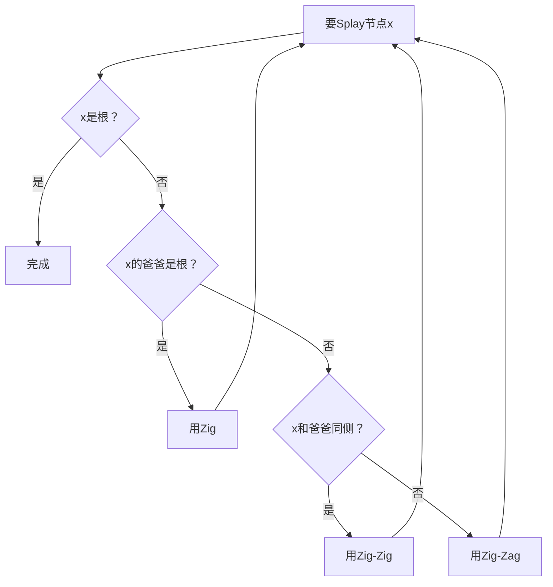

# 🌸 Splay树（伸展树）- 初学者完全教程
## *千禧年科技学院 - ユウカ老师的数据结构课*

*"想象一下，你有一个神奇的书架，每次你拿一本书，这本书就会自动跳到最容易拿到的位置！"*

---

## 🎯 开始之前 - 什么是Splay树？

### 最简单的理解

想象你有一个**智能书架**：
- 📚 书架上的书按照编号排序（就像二叉搜索树）
- 🔄 每次你拿一本书，**这本书就会自动跳到书架顶部**
- ⚡ 你经常拿的书总是在最容易拿到的地方

**Splay树就是这样的一个"智能书架"！**

### 🌟 核心思想

```
每次访问一个节点 → 把它转到根部 → 下次访问更快
```

---

## 📖 第一章：从普通的二叉搜索树说起

### 🌳 回忆：什么是二叉搜索树？

想象一个家族族谱：
- 每个人都有一个年龄（数字）
- **左边的孩子年龄更小**
- **右边的孩子年龄更大**

```
    祖父(50)
   /        \
儿子(30)    叔叔(70)
 /    \     /    \
孙子(20) 女儿(40) 侄子(60) 侄女(80)
```

### 🤔 普通二叉搜索树的问题

如果我们总是找年龄为20的孙子：
```
第1次查找：50 → 30 → 20 (走了3步)
第2次查找：50 → 30 → 20 (还是3步)
第3次查找：50 → 30 → 20 (依然3步)
```

**每次都要从头开始找，太麻烦了！**

---

## 🚀 第二章：Splay树的神奇之处

### ✨ Splay的魔法

Splay树说："**既然你经常找20，那我就把20放到最顶上！**"

**找20之前：**
```
    50
   /  \
  30   70
 /    /  \
20   60   80
```

**找20之后（经过Splay操作）：**
```
    20
     \
      30
       \
        50
         \
          70
         /  \
        60   80
```

**下次再找20：** 只需要1步！

### 🎯 Splay操作的三种武器

就像武侠小说里的三种招式：

1. **Zig（单旋）** - 简单一招
2. **Zig-Zig（双旋同向）** - 连环招式
3. **Zig-Zag（双旋异向）** - 变化招式

---

## 🎭 第三章：三种旋转详解

### 🎯 招式一：Zig旋转（最简单）

**什么时候用？** 当你要找的节点的爸爸就是根节点时

**例子：** 找节点30，它的爸爸50是根

```
旋转前：          旋转后：
    50               30
   /  \     Zig     /  \
  30   70   →      20   50
 /                      /  \
20                     40   70
```

**代码实现：**
```cpp
// 右旋转（Zig）
void rotateRight(Node* node) {
    Node* left = node->left;
    node->left = left->right;
    left->right = node;
    // 更新根节点
    root = left;
}
```

### 🎯 招式二：Zig-Zig旋转（连环招）

**什么时候用？** 当你要找的节点和它爸爸在同一侧时

**例子：** 找节点10，它在左侧，爸爸20也在左侧

```
旋转前：                旋转后：
      50                   10
     /  \                 /  \
    20   70     Zig-Zig   5   20
   /           →             /  \
  10                        15   50
 /  \                           /  \
5   15                         30   70
```

**步骤：**
1. 先旋转爷爷和爸爸
2. 再旋转爸爸和孩子

### 🎯 招式三：Zig-Zag旋转（变化招）

**什么时候用？** 当你要找的节点和它爸爸在不同侧时

**例子：** 找节点15，它在右侧，但爸爸10在左侧

```
旋转前：                旋转后：
      50                   15
     /  \                 /  \
    10   70     Zig-Zag   10   50
     \          →        /   /  \
      15               5   30   70
     /  \
    12   30
```

**步骤：**
1. 先让孩子和爸爸旋转
2. 再让孩子和爷爷旋转

---

## 🎪 第四章：完整的Splay过程演示

### 🎬 实战演示：查找节点5

**初始状态：**
```
        20
       /  \
      10   30
     /  \    \
    5   15   40
   /
  2
```

**目标：** 找到节点5并把它移到根部

**第一步：5的爸爸是10，爷爷是20，都在左侧 → 用Zig-Zig**

```
第一次Zig-Zig后：
    5
   /  \
  2    10
       /  \
      ?    20
           /  \
          15   30
               \
                40
```

**第二步：5已经是根了，完成！**

### 🎯 记住决策规则



---

## 💻 第五章：简单代码实现

### 🌸 最简单的Splay树

```cpp
#include <iostream>
using namespace std;

struct Node {
    int key;
    Node* left;
    Node* right;
    
    Node(int k) : key(k), left(nullptr), right(nullptr) {}
};

class SimpleSplayTree {
private:
    Node* root;
    
    // 右旋转
    Node* rotateRight(Node* node) {
        Node* left = node->left;
        node->left = left->right;
        left->right = node;
        return left;  // 返回新的根
    }
    
    // 左旋转
    Node* rotateLeft(Node* node) {
        Node* right = node->right;
        node->right = right->left;
        right->left = node;
        return right;  // 返回新的根
    }
    
    // 核心的Splay操作
    Node* splay(Node* root, int key) {
        if (!root || root->key == key) {
            return root;
        }
        
        // 在左子树中
        if (key < root->key) {
            if (!root->left) return root;
            
            // Zig-Zig (左-左)
            if (key < root->left->key) {
                root->left->left = splay(root->left->left, key);
                root = rotateRight(root);
            }
            // Zig-Zag (左-右)
            else if (key > root->left->key) {
                root->left->right = splay(root->left->right, key);
                if (root->left->right) {
                    root->left = rotateLeft(root->left);
                }
            }
            
            return root->left ? rotateRight(root) : root;
        }
        // 在右子树中
        else {
            if (!root->right) return root;
            
            // Zig-Zag (右-左)
            if (key < root->right->key) {
                root->right->left = splay(root->right->left, key);
                if (root->right->left) {
                    root->right = rotateRight(root->right);
                }
            }
            // Zig-Zig (右-右)
            else if (key > root->right->key) {
                root->right->right = splay(root->right->right, key);
                root = rotateLeft(root);
            }
            
            return root->right ? rotateLeft(root) : root;
        }
    }
    
public:
    SimpleSplayTree() : root(nullptr) {}
    
    // 插入
    void insert(int key) {
        if (!root) {
            root = new Node(key);
            return;
        }
        
        root = splay(root, key);
        
        if (root->key == key) return;  // 已存在
        
        Node* newNode = new Node(key);
        if (key < root->key) {
            newNode->left = root->left;
            newNode->right = root;
            root->left = nullptr;
        } else {
            newNode->right = root->right;
            newNode->left = root;
            root->right = nullptr;
        }
        root = newNode;
    }
    
    // 查找
    bool search(int key) {
        root = splay(root, key);
        return root && root->key == key;
    }
    
    // 删除
    void remove(int key) {
        if (!root) return;
        
        root = splay(root, key);
        if (root->key != key) return;
        
        if (!root->left) {
            root = root->right;
        } else {
            Node* temp = root;
            root = splay(root->left, key);
            root->right = temp->right;
            delete temp;
        }
    }
    
    // 中序遍历（用于查看结果）
    void inorder() {
        inorderHelper(root);
        cout << endl;
    }
    
    void inorderHelper(Node* node) {
        if (!node) return;
        inorderHelper(node->left);
        cout << node->key << " ";
        inorderHelper(node->right);
    }
    
    // 显示树结构
    void printTree() {
        cout << "当前树结构：" << endl;
        printHelper(root, "", true);
        cout << endl;
    }
    
    void printHelper(Node* node, string indent, bool isLast) {
        if (!node) return;
        
        cout << indent;
        if (isLast) {
            cout << "└── ";
            indent += "    ";
        } else {
            cout << "├── ";
            indent += "│   ";
        }
        cout << node->key << endl;
        
        if (node->left || node->right) {
            if (node->right) {
                printHelper(node->right, indent, !node->left);
            }
            if (node->left) {
                printHelper(node->left, indent, true);
            }
        }
    }
};
```

### 🎮 测试代码

```cpp
int main() {
    SimpleSplayTree tree;
    
    cout << "=== Splay树演示 ===" << endl;
    
    // 插入一些数据
    cout << "插入: 50, 30, 70, 20, 40, 60, 80" << endl;
    tree.insert(50);
    tree.insert(30);
    tree.insert(70);
    tree.insert(20);
    tree.insert(40);
    tree.insert(60);
    tree.insert(80);
    
    cout << "插入后的树：" << endl;
    tree.printTree();
    
    // 查找20
    cout << "查找20..." << endl;
    if (tree.search(20)) {
        cout << "找到了！现在20被移到了根部：" << endl;
        tree.printTree();
    }
    
    // 查找80
    cout << "查找80..." << endl;
    if (tree.search(80)) {
        cout << "找到了！现在80被移到了根部：" << endl;
        tree.printTree();
    }
    
    return 0;
}
```

---

## 🏆 第六章：Splay树的优势

### ✨ 为什么要学Splay树？

1. **自动调整** - 不需要手动平衡
2. **实现简单** - 没有颜色、高度等复杂信息
3. **缓存友好** - 经常访问的数据在根部
4. **平均性能好** - 摊还复杂度O(log n)

### 🎯 适用场景

- **缓存系统** - 热点数据自动上浮
- **文本编辑器** - 光标位置附近的文本
- **数据库索引** - 频繁查询的记录
- **LRU缓存** - 最近使用的数据

### 📊 性能对比

| 操作 | 平均时间 | 最坏时间 | 空间复杂度 |
|------|----------|----------|------------|
| 查找 | O(log n) | O(n) | O(n) |
| 插入 | O(log n) | O(n) | O(n) |
| 删除 | O(log n) | O(n) | O(n) |

**注意：** 虽然最坏情况是O(n)，但在实际应用中，由于自调整特性，性能通常很好。

---

## 🎓 第七章：练习题

### 🌟 基础练习

1. **手工模拟**：在纸上画出查找过程
   ```
   初始树：   50
            /  \
           30   70
          /    /  \
         20   60   80
   
   问题：查找20后，树的结构是什么？
   ```

2. **编程练习**：实现一个简单的Splay树，支持插入、查找、删除

### 🏆 进阶挑战

1. **区间操作**：实现支持区间翻转的Splay树
2. **LRU缓存**：用Splay树实现LRU缓存
3. **动态排名**：实现第k小元素查询

---

## 🎯 总结

### 🌸 记住这些关键点

1. **Splay = 每次访问都移到根部**
2. **三种旋转：Zig、Zig-Zig、Zig-Zag**
3. **自动调整，无需手动平衡**
4. **经常访问的数据会自动上浮**

### 🎪 下节课预告

下次ユウカ老师将带大家学习**Treap**：一个结合了二叉搜索树和堆的神奇数据结构！

---

**🌸 "理解了Splay树，你就掌握了自调整数据结构的精髓！" - ユウカ老师**

*千禧年科技学院 - 让算法学习变得简单有趣！* 