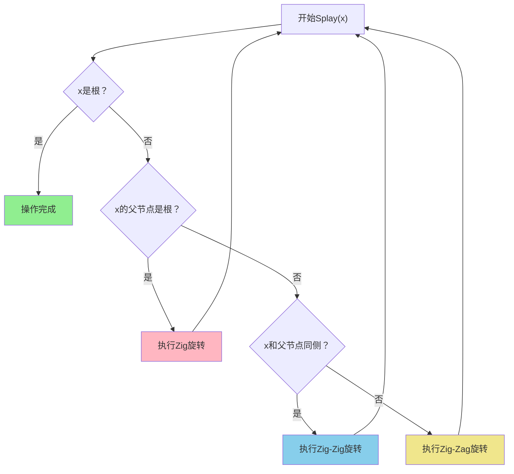

# 🌸 Splay树详解
## *千禧年科技学院 - ユウカ数据结构专题*

*"Splay树通过自调整实现高效的平均性能，它的旋转操作充满了数学之美！"*

---

## 📚 目录

1. [Splay树基本概念](#splay树基本概念)
2. [核心操作详解](#核心操作详解)
3. [算法实现](#算法实现)
4. [复杂度分析](#复杂度分析)
5. [经典应用](#经典应用)
6. [与其他平衡树对比](#与其他平衡树对比)
7. [优化技巧](#优化技巧)

---

## 🎯 Splay树基本概念

### 定义

**Splay树（伸展树）**是一种自调整的二叉搜索树，由Daniel Sleator和Robert Tarjan在1985年发明。它通过**Splay操作**将最近访问的节点移到根部，从而保证频繁访问的数据具有更快的访问速度。

### 🌟 核心思想

#### 核心理念：时间局部性
```
经常被访问的数据应该更容易访问
```

#### 自调整策略
- **每次访问节点后，将该节点旋转到根**
- **通过双旋转保持树的平衡性**
- **平摊时间复杂度为O(log n)**

### 🔍 基本性质

1. **自调整性**：每次操作后自动调整结构
2. **无需额外信息**：不需要存储高度、颜色等平衡信息
3. **缓存友好**：经常访问的数据靠近根部
4. **实现简单**：相比红黑树等更容易实现

---

## 🚀 核心操作详解

### 🎭 Splay操作

Splay操作是Splay树的核心，通过一系列旋转将目标节点移到根部。

#### 旋转类型

##### 1. Zig旋转（单旋转）
```
当x的父节点是根时使用

    p              x
   /      zig     / \
  x       ->     a   p
 / \                / \
a   b              b   c
```

##### 2. Zig-Zig旋转（同向双旋转）
```
当x和其父节点在同一侧时使用

      g                    x
     /                    / \
    p          zig-zig   a   p
   /            ->          / \
  x                        b   g
 / \                          / \
a   b                        c   d
```

##### 3. Zig-Zag旋转（异向双旋转）
```
当x和其父节点在不同侧时使用

  g                      x
 /          zig-zag     / \
p            ->        p   g
 \                    / \ / \
  x                  a  b c  d
 / \
b   c
```

### 🎯 Splay操作决策树



### 🌸 基本操作实现

#### 查找操作
```cpp
Node* find(Node* root, int key) {
    Node* result = search(root, key);
    if (result) {
        root = splay(root, key);
    }
    return root;
}
```

#### 插入操作
```cpp
Node* insert(Node* root, int key) {
    if (!root) return newNode(key);
    
    root = splay(root, key);
    
    if (root->key == key) return root;  // 已存在
    
    Node* newRoot = newNode(key);
    if (key < root->key) {
        newRoot->right = root;
        newRoot->left = root->left;
        root->left = nullptr;
    } else {
        newRoot->left = root;
        newRoot->right = root->right;
        root->right = nullptr;
    }
    
    return newRoot;
}
```

#### 删除操作
```cpp
Node* remove(Node* root, int key) {
    if (!root) return nullptr;
    
    root = splay(root, key);
    
    if (root->key != key) return root;  // 不存在
    
    if (!root->left) return root->right;
    if (!root->right) return root->left;
    
    Node* temp = root;
    root = splay(root->left, key);  // 找前驱
    root->right = temp->right;
    
    delete temp;
    return root;
}
```

---

## 💻 完整算法实现

### 🌸 Splay树完整实现

```cpp
#include <bits/stdc++.h>
using namespace std;

struct SplayNode {
    int key, size;
    SplayNode *left, *right, *parent;
    
    SplayNode(int k) : key(k), size(1), left(nullptr), 
                       right(nullptr), parent(nullptr) {}
};

class SplayTree {
private:
    SplayNode* root;
    
    void updateSize(SplayNode* node) {
        if (!node) return;
        node->size = 1;
        if (node->left) node->size += node->left->size;
        if (node->right) node->size += node->right->size;
    }
    
    void setParent(SplayNode* child, SplayNode* parent) {
        if (child) child->parent = parent;
    }
    
    void keepParent(SplayNode* node) {
        setParent(node->left, node);
        setParent(node->right, node);
    }
    
    void rotateLeft(SplayNode* node) {
        SplayNode* right = node->right;
        SplayNode* parent = node->parent;
        
        node->right = right->left;
        right->left = node;
        
        keepParent(node);
        keepParent(right);
        setParent(right, parent);
        
        if (parent) {
            if (parent->left == node) parent->left = right;
            else parent->right = right;
        }
        
        updateSize(node);
        updateSize(right);
    }
    
    void rotateRight(SplayNode* node) {
        SplayNode* left = node->left;
        SplayNode* parent = node->parent;
        
        node->left = left->right;
        left->right = node;
        
        keepParent(node);
        keepParent(left);
        setParent(left, parent);
        
        if (parent) {
            if (parent->left == node) parent->left = left;
            else parent->right = left;
        }
        
        updateSize(node);
        updateSize(left);
    }
    
    void splay(SplayNode* node) {
        if (!node) return;
        
        while (node->parent) {
            SplayNode* parent = node->parent;
            SplayNode* grandparent = parent->parent;
            
            if (!grandparent) {
                // Zig: 父节点是根
                if (parent->left == node) {
                    rotateRight(parent);
                } else {
                    rotateLeft(parent);
                }
            } else if ((grandparent->left == parent) == (parent->left == node)) {
                // Zig-Zig: 同向
                if (parent->left == node) {
                    rotateRight(grandparent);
                    rotateRight(parent);
                } else {
                    rotateLeft(grandparent);
                    rotateLeft(parent);
                }
            } else {
                // Zig-Zag: 异向
                if (parent->left == node) {
                    rotateRight(parent);
                    rotateLeft(grandparent);
                } else {
                    rotateLeft(parent);
                    rotateRight(grandparent);
                }
            }
        }
        
        root = node;
    }
    
    SplayNode* findNode(int key) {
        SplayNode* current = root;
        while (current) {
            if (key == current->key) {
                splay(current);
                return current;
            } else if (key < current->key) {
                current = current->left;
            } else {
                current = current->right;
            }
        }
        return nullptr;
    }
    
    SplayNode* findMin(SplayNode* node) {
        while (node->left) {
            node = node->left;
        }
        splay(node);
        return node;
    }
    
    SplayNode* findMax(SplayNode* node) {
        while (node->right) {
            node = node->right;
        }
        splay(node);
        return node;
    }
    
public:
    SplayTree() : root(nullptr) {}
    
    void insert(int key) {
        if (!root) {
            root = new SplayNode(key);
            return;
        }
        
        SplayNode* current = root;
        while (true) {
            if (key == current->key) {
                splay(current);
                return;  // 已存在
            } else if (key < current->key) {
                if (!current->left) {
                    current->left = new SplayNode(key);
                    setParent(current->left, current);
                    splay(current->left);
                    break;
                }
                current = current->left;
            } else {
                if (!current->right) {
                    current->right = new SplayNode(key);
                    setParent(current->right, current);
                    splay(current->right);
                    break;
                }
                current = current->right;
            }
        }
        
        // 更新路径上所有节点的size
        current = root;
        while (current) {
            updateSize(current);
            if (key < current->key) current = current->left;
            else if (key > current->key) current = current->right;
            else break;
        }
    }
    
    bool search(int key) {
        return findNode(key) != nullptr;
    }
    
    void remove(int key) {
        SplayNode* node = findNode(key);
        if (!node) return;
        
        if (!node->left && !node->right) {
            root = nullptr;
        } else if (!node->left) {
            root = node->right;
            root->parent = nullptr;
        } else if (!node->right) {
            root = node->left;
            root->parent = nullptr;
        } else {
            SplayNode* maxLeft = findMax(node->left);
            maxLeft->right = node->right;
            setParent(node->right, maxLeft);
            updateSize(maxLeft);
        }
        
        delete node;
    }
    
    int kth(int k) {
        SplayNode* current = root;
        while (current) {
            int leftSize = current->left ? current->left->size : 0;
            
            if (k <= leftSize) {
                current = current->left;
            } else if (k == leftSize + 1) {
                splay(current);
                return current->key;
            } else {
                k -= leftSize + 1;
                current = current->right;
            }
        }
        return -1;  // 不存在
    }
    
    int getRank(int key) {
        SplayNode* current = root;
        int rank = 1;
        
        while (current) {
            if (key == current->key) {
                if (current->left) rank += current->left->size;
                splay(current);
                return rank;
            } else if (key < current->key) {
                current = current->left;
            } else {
                if (current->left) rank += current->left->size;
                rank += 1;
                current = current->right;
            }
        }
        return -1;  // 不存在
    }
    
    int getPredecessor(int key) {
        SplayNode* node = findNode(key);
        if (!node || !node->left) return -1;
        
        return findMax(node->left)->key;
    }
    
    int getSuccessor(int key) {
        SplayNode* node = findNode(key);
        if (!node || !node->right) return -1;
        
        return findMin(node->right)->key;
    }
    
    void inorderTraversal() {
        inorderHelper(root);
        cout << endl;
    }
    
    void inorderHelper(SplayNode* node) {
        if (!node) return;
        inorderHelper(node->left);
        cout << node->key << " ";
        inorderHelper(node->right);
    }
    
    int getSize() {
        return root ? root->size : 0;
    }
    
    bool empty() {
        return root == nullptr;
    }
    
    // 调试函数：显示树结构
    void printTree() {
        cout << "Tree structure:" << endl;
        printHelper(root, "", true);
    }
    
    void printHelper(SplayNode* node, string indent, bool isLast) {
        if (!node) return;
        
        cout << indent;
        if (isLast) {
            cout << "└── ";
            indent += "    ";
        } else {
            cout << "├── ";
            indent += "│   ";
        }
        cout << node->key << "(size:" << node->size << ")" << endl;
        
        if (node->left || node->right) {
            if (node->right) {
                printHelper(node->right, indent, !node->left);
            }
            if (node->left) {
                printHelper(node->left, indent, true);
            }
        }
    }
};

// 区间操作的Splay树
class IntervalSplayTree {
private:
    struct Node {
        int key;
        bool reversed;
        Node *left, *right, *parent;
        
        Node(int k) : key(k), reversed(false), left(nullptr), 
                      right(nullptr), parent(nullptr) {}
    };
    
    Node* root;
    
    void pushDown(Node* node) {
        if (!node || !node->reversed) return;
        
        swap(node->left, node->right);
        if (node->left) node->left->reversed ^= true;
        if (node->right) node->right->reversed ^= true;
        node->reversed = false;
    }
    
    void splayInterval(Node* node) {
        // Splay操作的实现（类似上面的实现）
        // 注意在旋转前要pushDown
    }
    
public:
    IntervalSplayTree() : root(nullptr) {}
    
    void reverse(int l, int r) {
        // 1. Splay l-1到根
        // 2. Splay r+1到根的右子树根
        // 3. 翻转中间区间
    }
    
    void insert(int pos, int key) {
        // 在指定位置插入元素
    }
    
    void remove(int pos) {
        // 删除指定位置的元素
    }
};
```

### 🎯 简化版竞赛模板

```cpp
struct SplayNode {
    int key, size;
    SplayNode *l, *r;
    
    SplayNode(int k = 0) : key(k), size(1), l(nullptr), r(nullptr) {}
    
    void update() {
        size = 1;
        if (l) size += l->size;
        if (r) size += r->size;
    }
};

class SimpleSplay {
private:
    SplayNode* root;
    
    void zig(SplayNode*& p) {
        SplayNode* q = p->l;
        p->l = q->r; q->r = p;
        p->update(); q->update();
        p = q;
    }
    
    void zag(SplayNode*& p) {
        SplayNode* q = p->r;
        p->r = q->l; q->l = p;
        p->update(); q->update();
        p = q;
    }
    
    void splay(SplayNode*& p, int k) {
        if (!p) return;
        
        int leftSize = p->l ? p->l->size : 0;
        
        if (k <= leftSize) {
            splay(p->l, k);
            zig(p);
        } else if (k > leftSize + 1) {
            splay(p->r, k - leftSize - 1);
            zag(p);
        }
    }
    
public:
    SimpleSplay() : root(nullptr) {}
    
    void insert(int k) {
        insert(root, k);
    }
    
    void insert(SplayNode*& p, int k) {
        if (!p) {
            p = new SplayNode(k);
            return;
        }
        
        if (k <= p->key) {
            insert(p->l, k);
        } else {
            insert(p->r, k);
        }
        p->update();
    }
    
    int kth(int k) {
        splay(root, k);
        return root->key;
    }
    
    void remove(int k) {
        splay(root, k);
        // 删除根节点的逻辑
    }
};
```

---

## ⚡ 复杂度分析

### 时间复杂度

| 操作 | 最坏情况 | 平摊复杂度 | 期望复杂度 |
|------|----------|------------|------------|
| **查找** | O(n) | O(log n) | O(log n) |
| **插入** | O(n) | O(log n) | O(log n) |
| **删除** | O(n) | O(log n) | O(log n) |
| **第k小** | O(n) | O(log n) | O(log n) |

### 🎯 平摊分析要点

#### Access Lemma
对于任意节点序列的访问，Splay树的总代价不超过O(m log n + n log n)，其中m是操作数。

#### 势函数分析
定义势函数 Φ(T) = Σ log(size(v))，其中v是树中所有节点。

### 空间复杂度
- **存储空间**：O(n) - 每个节点存储常数个指针和数据
- **递归深度**：O(log n) 平摊，O(n) 最坏

---

## 🏆 经典应用

### 应用场景

#### 1. 动态维护有序序列
```cpp
void solveSequenceQueries() {
    SplayTree tree;
    int q;
    cin >> q;
    
    while (q--) {
        int op;
        cin >> op;
        
        if (op == 1) {  // 插入
            int x;
            cin >> x;
            tree.insert(x);
        } else if (op == 2) {  // 删除
            int x;
            cin >> x;
            tree.remove(x);
        } else if (op == 3) {  // 查询排名
            int x;
            cin >> x;
            cout << tree.getRank(x) << "\n";
        } else if (op == 4) {  // 查询第k小
            int k;
            cin >> k;
            cout << tree.kth(k) << "\n";
        } else if (op == 5) {  // 前驱
            int x;
            cin >> x;
            cout << tree.getPredecessor(x) << "\n";
        } else if (op == 6) {  // 后继
            int x;
            cin >> x;
            cout << tree.getSuccessor(x) << "\n";
        }
    }
}
```

#### 2. 文本编辑器
```cpp
class TextEditor {
private:
    struct TextNode {
        char ch;
        int size;
        TextNode *left, *right, *parent;
        
        TextNode(char c) : ch(c), size(1), left(nullptr), 
                          right(nullptr), parent(nullptr) {}
    };
    
    TextNode* root;
    int cursor;
    
public:
    void insertChar(char c) {
        // 在光标位置插入字符
    }
    
    void deleteChar() {
        // 删除光标前的字符
    }
    
    void moveCursor(int pos) {
        // 移动光标到指定位置
    }
    
    string substring(int l, int r) {
        // 提取子串
    }
};
```

#### 3. 区间翻转
```cpp
void reverseInterval(int l, int r) {
    // 1. 将l-1号元素splay到根
    if (l > 1) splay(root, l - 1);
    
    // 2. 将r+1号元素splay到根的右子树的根
    SplayNode* temp = root;
    if (r < n) {
        splay(temp->right, r - l + 2);
    }
    
    // 3. 现在[l,r]区间就是根的右子树的左子树
    SplayNode* target = temp->right->left;
    target->reversed ^= true;
}
```

### 经典例题

#### 例题1：洛谷P3369 - 普通平衡树
```cpp
int main() {
    SplayTree tree;
    int n;
    cin >> n;
    
    while (n--) {
        int op, x;
        cin >> op >> x;
        
        switch (op) {
            case 1: tree.insert(x); break;
            case 2: tree.remove(x); break;
            case 3: cout << tree.getRank(x) << "\n"; break;
            case 4: cout << tree.kth(x) << "\n"; break;
            case 5: cout << tree.getPredecessor(x) << "\n"; break;
            case 6: cout << tree.getSuccessor(x) << "\n"; break;
        }
    }
    
    return 0;
}
```

#### 例题2：文艺平衡树（区间翻转）
```cpp
class FancySplayTree {
private:
    struct Node {
        int value, size;
        bool reversed;
        Node *left, *right, *parent;
        
        Node(int v) : value(v), size(1), reversed(false),
                      left(nullptr), right(nullptr), parent(nullptr) {}
        
        void pushDown() {
            if (reversed) {
                swap(left, right);
                if (left) left->reversed ^= true;
                if (right) right->reversed ^= true;
                reversed = false;
            }
        }
        
        void update() {
            size = 1;
            if (left) size += left->size;
            if (right) size += right->size;
        }
    };
    
    Node* root;
    
public:
    void build(vector<int>& arr) {
        // 构建初始树
        for (int i = 0; i < arr.size(); i++) {
            insert(i + 1, arr[i]);
        }
    }
    
    void reverse(int l, int r) {
        // 区间翻转操作
        Node* leftBound = kthNode(l - 1);
        Node* rightBound = kthNode(r + 1);
        
        splay(leftBound);
        splay(rightBound, leftBound);
        
        Node* target = rightBound->left;
        if (target) target->reversed ^= true;
    }
    
    void printSequence() {
        inorderTraversal(root);
    }
};
```

---

## 🔍 与其他平衡树对比

### 性能对比表

| 平衡树类型 | 查找 | 插入 | 删除 | 第k小 | 实现难度 | 常数因子 |
|------------|------|------|------|-------|----------|----------|
| **Splay树** | O(log n)* | O(log n)* | O(log n)* | O(log n)* | 中等 | 较大 |
| **AVL树** | O(log n) | O(log n) | O(log n) | O(log n) | 困难 | 小 |
| **红黑树** | O(log n) | O(log n) | O(log n) | O(log n) | 困难 | 中等 |
| **Treap** | O(log n)* | O(log n)* | O(log n)* | O(log n)* | 简单 | 中等 |
| **替罪羊树** | O(log n)* | O(log n)* | O(log n)* | O(log n)* | 简单 | 较大 |

*表示平摊复杂度

### 🎯 优缺点分析

#### Splay树优点
- ✅ **实现相对简单**：不需要维护平衡因子或颜色
- ✅ **缓存友好**：频繁访问的数据靠近根部
- ✅ **支持区间操作**：天然支持区间翻转、区间查询
- ✅ **平摊性能优秀**：大多数情况下表现良好
- ✅ **空间效率高**：不需要额外的平衡信息

#### Splay树缺点
- ❌ **最坏情况较差**：退化时可能达到O(n)
- ❌ **常数因子较大**：旋转操作较多
- ❌ **不适合多线程**：旋转操作改变结构
- ❌ **实时性不佳**：无法保证单次操作的时间上界

---

## 💡 优化技巧

### 实现优化

#### 1. 迭代式Splay
```cpp
void iterativeSplay(SplayNode* node) {
    while (node->parent) {
        if (!node->parent->parent) {
            // Zig
            if (node->parent->left == node) rotateRight(node->parent);
            else rotateLeft(node->parent);
        } else if ((node->parent->left == node) == 
                   (node->parent->parent->left == node->parent)) {
            // Zig-Zig
            if (node->parent->left == node) {
                rotateRight(node->parent->parent);
                rotateRight(node->parent);
            } else {
                rotateLeft(node->parent->parent);
                rotateLeft(node->parent);
            }
        } else {
            // Zig-Zag
            if (node->parent->left == node) {
                rotateRight(node->parent);
                rotateLeft(node->parent);
            } else {
                rotateLeft(node->parent);
                rotateRight(node->parent);
            }
        }
    }
    root = node;
}
```

#### 2. 懒惰传播优化
```cpp
struct LazyNode {
    int value, size, lazy;
    bool reversed;
    LazyNode *left, *right;
    
    void pushDown() {
        if (lazy != 0) {
            value += lazy;
            if (left) left->lazy += lazy;
            if (right) right->lazy += lazy;
            lazy = 0;
        }
        
        if (reversed) {
            swap(left, right);
            if (left) left->reversed ^= true;
            if (right) right->reversed ^= true;
            reversed = false;
        }
    }
};
```

#### 3. 内存池优化
```cpp
class MemoryPool {
private:
    SplayNode pool[MAXN];
    int poolTop;
    
public:
    MemoryPool() : poolTop(0) {}
    
    SplayNode* newNode(int key) {
        pool[poolTop].key = key;
        pool[poolTop].size = 1;
        pool[poolTop].left = pool[poolTop].right = nullptr;
        return &pool[poolTop++];
    }
    
    void reset() {
        poolTop = 0;
    }
};
```

### 应用优化

#### 1. 访问顺序优化
```cpp
// 利用时间局部性
void processQueries(vector<Query>& queries) {
    // 按访问模式排序查询
    sort(queries.begin(), queries.end(), [](const Query& a, const Query& b) {
        return a.accessPattern < b.accessPattern;
    });
    
    SplayTree tree;
    for (auto& query : queries) {
        tree.process(query);
    }
}
```

#### 2. 批量操作优化
```cpp
void batchInsert(vector<int>& elements) {
    // 先排序再插入，减少旋转次数
    sort(elements.begin(), elements.end());
    
    for (int element : elements) {
        insert(element);
    }
}
```

---

## 🎓 学习建议

### 🌟 掌握要点

1. **理解旋转机制**：掌握三种旋转类型的应用场景
2. **实现细节**：注意父指针的维护和size的更新
3. **区间操作**：理解如何通过Splay实现区间操作
4. **优化策略**：学会根据应用场景选择优化方法

### 📚 推荐练习题

#### 入门级
1. **洛谷P3369** - 普通平衡树
2. **洛谷P3391** - 文艺平衡树
3. **HDU1890** - Robotic Sort

#### 进阶级
1. **洛谷P2042** - 维护数列
2. **BZOJ1500** - 维修数列
3. **SPOJ QTREE** - Query on a tree

#### 挑战级
1. **洛谷P4309** - 作诗
2. **CF295E** - Yaroslav and Points
3. **BZOJ2002** - Bounce

### 🚀 进阶方向

1. **Link-Cut Tree**：基于Splay的动态树
2. **Top Tree**：更高级的动态树结构
3. **Splay Tree的并发版本**：多线程环境下的实现
4. **持久化Splay Tree**：支持历史版本查询

---

<div align="center">

### 🌸 特别鸣谢

**感谢千禧年科技学院数据结构研究小组！**

> *"Splay树虽然没有严格的平衡保证，但它的自调整机制体现了算法设计的智慧。通过简单的旋转操作，它在实际应用中往往表现出色！"*
>
> — **ユウカ**

*🌸 在数据结构的世界里，每一种平衡树都有其独特的美！*

</div> 