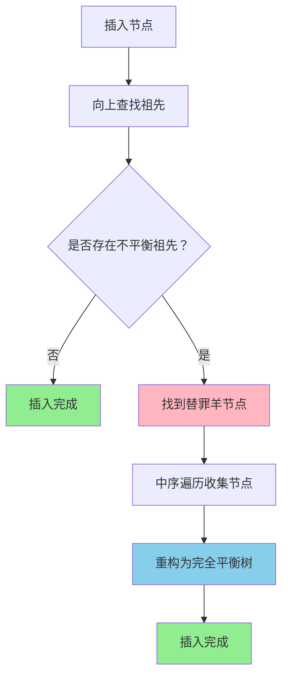

# 🌸 替罪羊树详解
## *千禧年科技学院 - ユウカ数据结构专题*

*"替罪羊树用重构的方式维护平衡，当子树不平衡时找到替罪羊进行重构！"*

---

## 📚 目录

1. [替罪羊树基本概念](#替罪羊树基本概念)
2. [平衡条件与重构](#平衡条件与重构)
3. [核心操作详解](#核心操作详解)
4. [算法实现](#算法实现)
5. [复杂度分析](#复杂度分析)
6. [经典应用](#经典应用)
7. [优化技巧](#优化技巧)

---

## 🎯 替罪羊树基本概念

### 定义

**替罪羊树（Scapegoat Tree）**是一种自平衡二叉搜索树，由Igal Galperin和Ronald L. Rivest在1993年发明。它通过**重构不平衡子树**来维护整体平衡性。

### 🌟 核心思想

#### 平衡策略：重构代替旋转
```
当发现不平衡时，找到"替罪羊"节点
重构以替罪羊为根的子树
```

#### 平衡参数α（alpha）
- **α ∈ (0.5, 1)**：平衡因子，通常取0.7或0.75
- **平衡条件**：对于任意节点，其左右子树大小比例不超过α

### 🔍 基本性质

1. **懒惰重构**：只有在必要时才重构
2. **全局重构**：重构整个子树而非局部调整
3. **无需额外信息**：不需要维护高度或平衡因子
4. **摊还分析**：单次操作可能耗时O(n)，但摊还复杂度O(log n)

---

## 🚀 平衡条件与重构

### 🎭 平衡条件

#### α-平衡条件
对于节点u，设size(u)为u的子树大小：
```
size(u.left) ≤ α × size(u)
size(u.right) ≤ α × size(u)
```

#### 重构触发条件
```
当插入节点时，如果存在祖先节点v满足：
size(v.left) > α × size(v) 或 size(v.right) > α × size(v)
则v就是"替罪羊"，需要重构以v为根的子树
```

### 🌸 重构过程

#### 1. 中序遍历收集节点
```cpp
void inorderCollect(Node* root, vector<Node*>& nodes) {
    if (!root) return;
    inorderCollect(root->left, nodes);
    nodes.push_back(root);
    inorderCollect(root->right, nodes);
}
```

#### 2. 构建完全平衡树
```cpp
Node* buildBalanced(vector<Node*>& nodes, int l, int r) {
    if (l > r) return nullptr;
    
    int mid = (l + r) / 2;
    Node* root = nodes[mid];
    
    root->left = buildBalanced(nodes, l, mid - 1);
    root->right = buildBalanced(nodes, mid + 1, r);
    
    updateSize(root);
    return root;
}
```

#### 3. 重构决策树



---

## 🎯 核心操作详解

### 🌸 插入操作

```cpp
bool insert(int key) {
    if (search(key)) return false;  // 已存在
    
    Node* newNode = new Node(key);
    root = insertHelper(root, newNode);
    maxSize++;
    
    // 检查是否需要重构
    if (newNode->size > alpha * maxSize) {
        Node* scapegoat = findScapegoat(newNode);
        if (scapegoat) {
            rebuildTree(scapegoat);
        }
    }
    
    return true;
}

Node* insertHelper(Node* root, Node* newNode) {
    if (!root) return newNode;
    
    if (newNode->key < root->key) {
        root->left = insertHelper(root->left, newNode);
    } else {
        root->right = insertHelper(root->right, newNode);
    }
    
    updateSize(root);
    return root;
}
```

### 🎪 查找替罪羊

```cpp
Node* findScapegoat(Node* node) {
    while (node->parent) {
        Node* parent = node->parent;
        
        // 检查父节点是否为替罪羊
        if (node->size > alpha * parent->size) {
            return parent;
        }
        
        node = parent;
    }
    
    return nullptr;  // 没有找到替罪羊
}
```

### 🎯 删除操作

```cpp
bool remove(int key) {
    if (!search(key)) return false;
    
    root = removeHelper(root, key);
    
    // 检查是否需要全局重构
    if (currentSize < alpha * maxSize) {
        rebuildTree(root);
        maxSize = currentSize;
    }
    
    return true;
}

Node* removeHelper(Node* root, int key) {
    if (!root) return nullptr;
    
    if (key < root->key) {
        root->left = removeHelper(root->left, key);
    } else if (key > root->key) {
        root->right = removeHelper(root->right, key);
    } else {
        // 找到要删除的节点
        currentSize--;
        
        if (!root->left && !root->right) {
            delete root;
            return nullptr;
        } else if (!root->left) {
            Node* temp = root->right;
            delete root;
            return temp;
        } else if (!root->right) {
            Node* temp = root->left;
            delete root;
            return temp;
        } else {
            // 找中序后继
            Node* successor = findMin(root->right);
            root->key = successor->key;
            root->right = removeHelper(root->right, successor->key);
        }
    }
    
    updateSize(root);
    return root;
}
```

---

## 💻 完整算法实现

### 🌸 基础替罪羊树

```cpp
#include <bits/stdc++.h>
using namespace std;

struct ScapegoatNode {
    int key, size;
    ScapegoatNode *left, *right, *parent;
    
    ScapegoatNode(int k) : key(k), size(1), left(nullptr), 
                          right(nullptr), parent(nullptr) {}
};

class ScapegoatTree {
private:
    ScapegoatNode* root;
    double alpha;
    int maxSize, currentSize;
    
    void updateSize(ScapegoatNode* node) {
        if (!node) return;
        node->size = 1;
        if (node->left) node->size += node->left->size;
        if (node->right) node->size += node->right->size;
    }
    
    void setParent(ScapegoatNode* child, ScapegoatNode* parent) {
        if (child) child->parent = parent;
    }
    
    void inorderCollect(ScapegoatNode* root, vector<ScapegoatNode*>& nodes) {
        if (!root) return;
        inorderCollect(root->left, nodes);
        nodes.push_back(root);
        inorderCollect(root->right, nodes);
    }
    
    ScapegoatNode* buildBalanced(vector<ScapegoatNode*>& nodes, int l, int r) {
        if (l > r) return nullptr;
        
        int mid = (l + r) / 2;
        ScapegoatNode* root = nodes[mid];
        
        root->left = buildBalanced(nodes, l, mid - 1);
        root->right = buildBalanced(nodes, mid + 1, r);
        
        setParent(root->left, root);
        setParent(root->right, root);
        updateSize(root);
        
        return root;
    }
    
    void rebuildTree(ScapegoatNode*& subtreeRoot) {
        if (!subtreeRoot) return;
        
        vector<ScapegoatNode*> nodes;
        inorderCollect(subtreeRoot, nodes);
        
        subtreeRoot = buildBalanced(nodes, 0, nodes.size() - 1);
        setParent(subtreeRoot, subtreeRoot->parent);
    }
    
    ScapegoatNode* findScapegoat(ScapegoatNode* node) {
        while (node && node->parent) {
            ScapegoatNode* parent = node->parent;
            
            if (node->size > alpha * parent->size) {
                return parent;
            }
            
            node = parent;
        }
        
        return nullptr;
    }
    
    bool needsRebuild(ScapegoatNode* node) {
        if (!node) return false;
        
        int leftSize = node->left ? node->left->size : 0;
        int rightSize = node->right ? node->right->size : 0;
        
        return leftSize > alpha * node->size || rightSize > alpha * node->size;
    }
    
    ScapegoatNode* insertHelper(ScapegoatNode* root, int key, ScapegoatNode* parent = nullptr) {
        if (!root) {
            ScapegoatNode* newNode = new ScapegoatNode(key);
            setParent(newNode, parent);
            return newNode;
        }
        
        if (key < root->key) {
            root->left = insertHelper(root->left, key, root);
        } else if (key > root->key) {
            root->right = insertHelper(root->right, key, root);
        } else {
            return root;  // 已存在
        }
        
        updateSize(root);
        return root;
    }
    
    ScapegoatNode* removeHelper(ScapegoatNode* root, int key) {
        if (!root) return nullptr;
        
        if (key < root->key) {
            root->left = removeHelper(root->left, key);
            setParent(root->left, root);
        } else if (key > root->key) {
            root->right = removeHelper(root->right, key);
            setParent(root->right, root);
        } else {
            currentSize--;
            
            if (!root->left && !root->right) {
                delete root;
                return nullptr;
            } else if (!root->left) {
                ScapegoatNode* temp = root->right;
                delete root;
                return temp;
            } else if (!root->right) {
                ScapegoatNode* temp = root->left;
                delete root;
                return temp;
            } else {
                ScapegoatNode* successor = findMin(root->right);
                root->key = successor->key;
                root->right = removeHelper(root->right, successor->key);
                setParent(root->right, root);
            }
        }
        
        updateSize(root);
        return root;
    }
    
    ScapegoatNode* findMin(ScapegoatNode* root) {
        while (root->left) root = root->left;
        return root;
    }
    
    ScapegoatNode* findMax(ScapegoatNode* root) {
        while (root->right) root = root->right;
        return root;
    }
    
    bool searchHelper(ScapegoatNode* root, int key) {
        if (!root) return false;
        
        if (key == root->key) return true;
        else if (key < root->key) return searchHelper(root->left, key);
        else return searchHelper(root->right, key);
    }
    
    int kthHelper(ScapegoatNode* root, int k) {
        if (!root) return -1;
        
        int leftSize = root->left ? root->left->size : 0;
        
        if (k <= leftSize) {
            return kthHelper(root->left, k);
        } else if (k == leftSize + 1) {
            return root->key;
        } else {
            return kthHelper(root->right, k - leftSize - 1);
        }
    }
    
    int getRankHelper(ScapegoatNode* root, int key) {
        if (!root) return 0;
        
        if (key <= root->key) {
            return getRankHelper(root->left, key);
        } else {
            int leftSize = root->left ? root->left->size : 0;
            return leftSize + 1 + getRankHelper(root->right, key);
        }
    }
    
public:
    ScapegoatTree(double a = 0.75) : root(nullptr), alpha(a), maxSize(0), currentSize(0) {}
    
    void insert(int key) {
        if (search(key)) return;  // 已存在
        
        root = insertHelper(root, key);
        maxSize++;
        currentSize++;
        
        // 检查是否需要重构
        ScapegoatNode* current = root;
        while (current) {
            if (needsRebuild(current)) {
                if (current == root) {
                    rebuildTree(root);
                } else {
                    if (current->parent->left == current) {
                        rebuildTree(current->parent->left);
                    } else {
                        rebuildTree(current->parent->right);
                    }
                }
                break;
            }
            current = current->parent;
        }
    }
    
    void remove(int key) {
        if (!search(key)) return;
        
        root = removeHelper(root, key);
        
        // 检查是否需要全局重构
        if (currentSize < alpha * maxSize) {
            rebuildTree(root);
            maxSize = currentSize;
        }
    }
    
    bool search(int key) {
        return searchHelper(root, key);
    }
    
    int kth(int k) {
        if (k < 1 || k > currentSize) return -1;
        return kthHelper(root, k);
    }
    
    int getRank(int key) {
        return getRankHelper(root, key) + 1;
    }
    
    int getPredecessor(int key) {
        ScapegoatNode* current = root;
        int result = -1;
        
        while (current) {
            if (current->key < key) {
                result = current->key;
                current = current->right;
            } else {
                current = current->left;
            }
        }
        
        return result;
    }
    
    int getSuccessor(int key) {
        ScapegoatNode* current = root;
        int result = -1;
        
        while (current) {
            if (current->key > key) {
                result = current->key;
                current = current->left;
            } else {
                current = current->right;
            }
        }
        
        return result;
    }
    
    void inorderTraversal() {
        inorderHelper(root);
        cout << endl;
    }
    
    void inorderHelper(ScapegoatNode* root) {
        if (!root) return;
        inorderHelper(root->left);
        cout << root->key << " ";
        inorderHelper(root->right);
    }
    
    int getSize() {
        return currentSize;
    }
    
    bool empty() {
        return currentSize == 0;
    }
    
    // 调试函数
    void printTree() {
        cout << "Tree structure (α = " << alpha << "):" << endl;
        printHelper(root, "", true);
        cout << "Current size: " << currentSize << ", Max size: " << maxSize << endl;
    }
    
    void printHelper(ScapegoatNode* node, string indent, bool isLast) {
        if (!node) return;
        
        cout << indent;
        if (isLast) {
            cout << "└── ";
            indent += "    ";
        } else {
            cout << "├── ";
            indent += "│   ";
        }
        
        cout << node->key << "(size:" << node->size << ")";
        
        // 检查是否平衡
        if (needsRebuild(node)) {
            cout << " [UNBALANCED]";
        }
        
        cout << endl;
        
        if (node->left || node->right) {
            if (node->right) {
                printHelper(node->right, indent, !node->left);
            }
            if (node->left) {
                printHelper(node->left, indent, true);
            }
        }
    }
    
    // 统计重构次数
    int rebuildCount = 0;
    
    void rebuildTreeWithCount(ScapegoatNode*& subtreeRoot) {
        rebuildCount++;
        rebuildTree(subtreeRoot);
    }
    
    double getAlpha() const {
        return alpha;
    }
    
    void setAlpha(double a) {
        if (a > 0.5 && a < 1.0) {
            alpha = a;
        }
    }
};
```

### 🎯 支持重复元素的替罪羊树

```cpp
struct MultiScapegoatNode {
    int key, count, size;
    MultiScapegoatNode *left, *right, *parent;
    
    MultiScapegoatNode(int k) : key(k), count(1), size(1), 
                               left(nullptr), right(nullptr), parent(nullptr) {}
};

class MultiScapegoatTree {
private:
    MultiScapegoatNode* root;
    double alpha;
    int maxSize, currentSize;
    
    void updateSize(MultiScapegoatNode* node) {
        if (!node) return;
        node->size = node->count;
        if (node->left) node->size += node->left->size;
        if (node->right) node->size += node->right->size;
    }
    
    void inorderCollect(MultiScapegoatNode* root, vector<MultiScapegoatNode*>& nodes) {
        if (!root) return;
        inorderCollect(root->left, nodes);
        nodes.push_back(root);
        inorderCollect(root->right, nodes);
    }
    
    MultiScapegoatNode* buildBalanced(vector<MultiScapegoatNode*>& nodes, int l, int r) {
        if (l > r) return nullptr;
        
        int mid = (l + r) / 2;
        MultiScapegoatNode* root = nodes[mid];
        
        root->left = buildBalanced(nodes, l, mid - 1);
        root->right = buildBalanced(nodes, mid + 1, r);
        
        setParent(root->left, root);
        setParent(root->right, root);
        updateSize(root);
        
        return root;
    }
    
    void setParent(MultiScapegoatNode* child, MultiScapegoatNode* parent) {
        if (child) child->parent = parent;
    }
    
    void rebuildTree(MultiScapegoatNode*& subtreeRoot) {
        if (!subtreeRoot) return;
        
        vector<MultiScapegoatNode*> nodes;
        inorderCollect(subtreeRoot, nodes);
        
        subtreeRoot = buildBalanced(nodes, 0, nodes.size() - 1);
        setParent(subtreeRoot, subtreeRoot->parent);
    }
    
    bool needsRebuild(MultiScapegoatNode* node) {
        if (!node) return false;
        
        int leftSize = node->left ? node->left->size : 0;
        int rightSize = node->right ? node->right->size : 0;
        
        return leftSize > alpha * node->size || rightSize > alpha * node->size;
    }
    
    MultiScapegoatNode* insertHelper(MultiScapegoatNode* root, int key, MultiScapegoatNode* parent = nullptr) {
        if (!root) {
            MultiScapegoatNode* newNode = new MultiScapegoatNode(key);
            setParent(newNode, parent);
            return newNode;
        }
        
        if (key < root->key) {
            root->left = insertHelper(root->left, key, root);
        } else if (key > root->key) {
            root->right = insertHelper(root->right, key, root);
        } else {
            root->count++;
            currentSize++;
        }
        
        updateSize(root);
        return root;
    }
    
public:
    MultiScapegoatTree(double a = 0.75) : root(nullptr), alpha(a), maxSize(0), currentSize(0) {}
    
    void insert(int key) {
        bool isNew = !search(key);
        root = insertHelper(root, key);
        
        if (isNew) {
            maxSize++;
            currentSize++;
            
            // 检查是否需要重构
            MultiScapegoatNode* current = root;
            while (current) {
                if (needsRebuild(current)) {
                    if (current == root) {
                        rebuildTree(root);
                    } else {
                        if (current->parent->left == current) {
                            rebuildTree(current->parent->left);
                        } else {
                            rebuildTree(current->parent->right);
                        }
                    }
                    break;
                }
                current = current->parent;
            }
        }
    }
    
    void remove(int key) {
        MultiScapegoatNode* node = findNode(root, key);
        if (!node) return;
        
        if (node->count > 1) {
            node->count--;
            currentSize--;
            
            // 更新路径上的size
            MultiScapegoatNode* current = node;
            while (current) {
                updateSize(current);
                current = current->parent;
            }
        } else {
            root = removeHelper(root, key);
            
            // 检查是否需要全局重构
            if (currentSize < alpha * maxSize) {
                rebuildTree(root);
                maxSize = currentSize;
            }
        }
    }
    
    bool search(int key) {
        return findNode(root, key) != nullptr;
    }
    
    int count(int key) {
        MultiScapegoatNode* node = findNode(root, key);
        return node ? node->count : 0;
    }
    
    MultiScapegoatNode* findNode(MultiScapegoatNode* root, int key) {
        if (!root) return nullptr;
        
        if (key == root->key) return root;
        else if (key < root->key) return findNode(root->left, key);
        else return findNode(root->right, key);
    }
    
    MultiScapegoatNode* removeHelper(MultiScapegoatNode* root, int key) {
        if (!root) return nullptr;
        
        if (key < root->key) {
            root->left = removeHelper(root->left, key);
            setParent(root->left, root);
        } else if (key > root->key) {
            root->right = removeHelper(root->right, key);
            setParent(root->right, root);
        } else {
            currentSize -= root->count;
            
            if (!root->left && !root->right) {
                delete root;
                return nullptr;
            } else if (!root->left) {
                MultiScapegoatNode* temp = root->right;
                delete root;
                return temp;
            } else if (!root->right) {
                MultiScapegoatNode* temp = root->left;
                delete root;
                return temp;
            } else {
                MultiScapegoatNode* successor = findMin(root->right);
                root->key = successor->key;
                root->count = successor->count;
                successor->count = 1;  // 避免重复减少
                root->right = removeHelper(root->right, successor->key);
                setParent(root->right, root);
            }
        }
        
        updateSize(root);
        return root;
    }
    
    MultiScapegoatNode* findMin(MultiScapegoatNode* root) {
        while (root->left) root = root->left;
        return root;
    }
};
```

### 🎪 动态α值的替罪羊树

```cpp
class AdaptiveScapegoatTree {
private:
    ScapegoatTree tree;
    double baseAlpha;
    int operationCount;
    int rebuildCount;
    
    void adjustAlpha() {
        operationCount++;
        
        if (operationCount % 100 == 0) {  // 每100次操作调整一次
            double rebuildRatio = (double)rebuildCount / operationCount;
            
            if (rebuildRatio > 0.1) {  // 重构太频繁，增加α
                tree.setAlpha(min(0.9, tree.getAlpha() + 0.05));
            } else if (rebuildRatio < 0.01) {  // 重构太少，减少α
                tree.setAlpha(max(0.6, tree.getAlpha() - 0.05));
            }
        }
    }
    
public:
    AdaptiveScapegoatTree(double a = 0.75) : tree(a), baseAlpha(a), 
                                            operationCount(0), rebuildCount(0) {}
    
    void insert(int key) {
        int oldRebuildCount = tree.rebuildCount;
        tree.insert(key);
        
        if (tree.rebuildCount > oldRebuildCount) {
            rebuildCount++;
        }
        
        adjustAlpha();
    }
    
    void remove(int key) {
        int oldRebuildCount = tree.rebuildCount;
        tree.remove(key);
        
        if (tree.rebuildCount > oldRebuildCount) {
            rebuildCount++;
        }
        
        adjustAlpha();
    }
    
    bool search(int key) {
        return tree.search(key);
    }
    
    void printStats() {
        cout << "Operations: " << operationCount << endl;
        cout << "Rebuilds: " << rebuildCount << endl;
        cout << "Current α: " << tree.getAlpha() << endl;
        cout << "Rebuild ratio: " << (double)rebuildCount / operationCount << endl;
    }
};
```

---

## ⚡ 复杂度分析

### 时间复杂度

| 操作 | 最坏情况 | 平摊复杂度 | 说明 |
|------|----------|------------|------|
| **查找** | O(log n) | O(log n) | 深度始终为O(log n) |
| **插入** | O(n) | O(log n) | 重构时需要O(n) |
| **删除** | O(n) | O(log n) | 重构时需要O(n) |
| **重构** | O(n) | - | 单次重构成本 |

### 🎯 平摊分析

#### 势函数方法
定义势函数 Φ(T) = 不平衡节点数量
- 每次插入增加势能
- 重构时释放大量势能
- 摊还成本为O(log n)

#### 重构频率
- 插入n个元素最多重构O(n)次
- 每个节点平均被重构O(log n)次
- 总摊还成本为O(n log n)

### 🌸 α值的选择

#### 理论分析
- **α = 0.5**：完全平衡，但重构过于频繁
- **α = 1.0**：永不重构，退化为链表
- **α = 0.7-0.8**：实践中的最佳选择

#### 性能对比

| α值 | 深度保证 | 重构频率 | 推荐场景 |
|-----|----------|----------|----------|
| **0.6** | 更平衡 | 较频繁 | 查找密集型 |
| **0.75** | 平衡 | 适中 | 通用场景 |
| **0.9** | 较松散 | 较少 | 插入密集型 |

### 空间复杂度
- **基本结构**：O(n)
- **重构临时空间**：O(n)

---

## 🏆 经典应用

### 应用场景

#### 1. 普通平衡树
```cpp
void solveBST() {
    ScapegoatTree tree(0.75);
    int q;
    cin >> q;
    
    while (q--) {
        int op;
        cin >> op;
        
        switch (op) {
            case 1: {  // 插入
                int x;
                cin >> x;
                tree.insert(x);
                break;
            }
            case 2: {  // 删除
                int x;
                cin >> x;
                tree.remove(x);
                break;
            }
            case 3: {  // 查询排名
                int x;
                cin >> x;
                cout << tree.getRank(x) << "\n";
                break;
            }
            case 4: {  // 查询第k小
                int k;
                cin >> k;
                cout << tree.kth(k) << "\n";
                break;
            }
            case 5: {  // 前驱
                int x;
                cin >> x;
                cout << tree.getPredecessor(x) << "\n";
                break;
            }
            case 6: {  // 后继
                int x;
                cin >> x;
                cout << tree.getSuccessor(x) << "\n";
                break;
            }
        }
    }
}
```

#### 2. 动态第k大
```cpp
class DynamicKth {
private:
    ScapegoatTree tree;
    
public:
    void insert(int x) {
        tree.insert(x);
    }
    
    void remove(int x) {
        tree.remove(x);
    }
    
    int kth(int k) {
        return tree.kth(k);
    }
    
    int count() {
        return tree.getSize();
    }
    
    vector<int> getTopK(int k) {
        vector<int> result;
        for (int i = tree.getSize() - k + 1; i <= tree.getSize(); i++) {
            result.push_back(tree.kth(i));
        }
        return result;
    }
};
```

#### 3. 区间查询
```cpp
class RangeQuery {
private:
    ScapegoatTree tree;
    
public:
    void insert(int x) {
        tree.insert(x);
    }
    
    int countInRange(int l, int r) {
        int leftRank = tree.getRank(l);
        int rightRank = tree.getRank(r + 1);
        return rightRank - leftRank;
    }
    
    vector<int> getInRange(int l, int r) {
        vector<int> result;
        int leftRank = tree.getRank(l);
        int rightRank = tree.getRank(r + 1);
        
        for (int i = leftRank; i < rightRank; i++) {
            result.push_back(tree.kth(i));
        }
        
        return result;
    }
};
```

### 经典例题

#### 例题1：洛谷P3369 - 普通平衡树
```cpp
int main() {
    ScapegoatTree tree;
    int n;
    cin >> n;
    
    while (n--) {
        int op, x;
        cin >> op >> x;
        
        switch (op) {
            case 1: tree.insert(x); break;
            case 2: tree.remove(x); break;
            case 3: cout << tree.getRank(x) << "\n"; break;
            case 4: cout << tree.kth(x) << "\n"; break;
            case 5: cout << tree.getPredecessor(x) << "\n"; break;
            case 6: cout << tree.getSuccessor(x) << "\n"; break;
        }
    }
    
    return 0;
}
```

#### 例题2：动态逆序对
```cpp
class DynamicInversions {
private:
    ScapegoatTree tree;
    long long inversions;
    
public:
    DynamicInversions() : inversions(0) {}
    
    void insert(int x) {
        // 计算比x大的数的个数
        int total = tree.getSize();
        int rank = tree.getRank(x);
        inversions += total - rank + 1;
        
        tree.insert(x);
    }
    
    void remove(int x) {
        int total = tree.getSize();
        int rank = tree.getRank(x);
        inversions -= total - rank;
        
        tree.remove(x);
    }
    
    long long getInversions() {
        return inversions;
    }
};
```

#### 例题3：滑动窗口第k大
```cpp
class SlidingWindowKth {
private:
    ScapegoatTree tree;
    queue<int> window;
    int windowSize;
    
public:
    SlidingWindowKth(int k) : windowSize(k) {}
    
    int addAndGetKth(int x, int k) {
        window.push(x);
        tree.insert(x);
        
        if (window.size() > windowSize) {
            int removed = window.front();
            window.pop();
            tree.remove(removed);
        }
        
        return tree.kth(k);
    }
    
    vector<int> processArray(vector<int>& arr, int k) {
        vector<int> result;
        
        for (int x : arr) {
            int kth = addAndGetKth(x, k);
            if (window.size() == windowSize) {
                result.push_back(kth);
            }
        }
        
        return result;
    }
};
```

---

## 💡 优化技巧

### 实现优化

#### 1. 延迟重构
```cpp
class LazyScapegoatTree {
private:
    ScapegoatTree tree;
    int operationsSinceRebuild;
    const int rebuildThreshold = 100;
    
public:
    void insert(int key) {
        tree.insert(key);
        operationsSinceRebuild++;
        
        if (operationsSinceRebuild >= rebuildThreshold) {
            // 执行全局重构
            tree.rebuildTree(tree.root);
            operationsSinceRebuild = 0;
        }
    }
    
    void remove(int key) {
        tree.remove(key);
        operationsSinceRebuild++;
        
        if (operationsSinceRebuild >= rebuildThreshold) {
            tree.rebuildTree(tree.root);
            operationsSinceRebuild = 0;
        }
    }
};
```

#### 2. 批量重构
```cpp
class BatchRebuildTree {
private:
    ScapegoatTree tree;
    vector<int> pendingInserts;
    vector<int> pendingRemoves;
    const int batchSize = 50;
    
public:
    void insert(int key) {
        pendingInserts.push_back(key);
        
        if (pendingInserts.size() >= batchSize) {
            processBatch();
        }
    }
    
    void remove(int key) {
        pendingRemoves.push_back(key);
        
        if (pendingRemoves.size() >= batchSize) {
            processBatch();
        }
    }
    
private:
    void processBatch() {
        // 收集所有现有节点
        vector<int> allNodes;
        tree.getAllNodes(allNodes);
        
        // 合并待处理的操作
        for (int x : pendingInserts) {
            allNodes.push_back(x);
        }
        
        for (int x : pendingRemoves) {
            allNodes.erase(find(allNodes.begin(), allNodes.end(), x));
        }
        
        // 重构整个树
        tree.buildFromSorted(allNodes);
        
        pendingInserts.clear();
        pendingRemoves.clear();
    }
};
```

#### 3. 内存优化
```cpp
class MemoryOptimizedScapegoat {
private:
    struct CompactNode {
        int key;
        short size;  // 使用short节省内存
        CompactNode* left;
        CompactNode* right;
        
        CompactNode(int k) : key(k), size(1), left(nullptr), right(nullptr) {}
    };
    
    CompactNode* root;
    vector<CompactNode*> freeList;  // 内存池
    
public:
    CompactNode* newNode(int key) {
        if (!freeList.empty()) {
            CompactNode* node = freeList.back();
            freeList.pop_back();
            node->key = key;
            node->size = 1;
            node->left = node->right = nullptr;
            return node;
        }
        
        return new CompactNode(key);
    }
    
    void deleteNode(CompactNode* node) {
        if (node) {
            freeList.push_back(node);
        }
    }
};
```

### 应用优化

#### 1. 自适应α值
```cpp
class AdaptiveAlpha {
private:
    double currentAlpha;
    int queryCount;
    int insertCount;
    double queryRatio;
    
public:
    AdaptiveAlpha() : currentAlpha(0.75), queryCount(0), insertCount(0) {}
    
    void recordQuery() {
        queryCount++;
        updateAlpha();
    }
    
    void recordInsert() {
        insertCount++;
        updateAlpha();
    }
    
private:
    void updateAlpha() {
        if (queryCount + insertCount > 100) {
            queryRatio = (double)queryCount / (queryCount + insertCount);
            
            if (queryRatio > 0.8) {
                // 查询密集，使用较小的α
                currentAlpha = 0.6;
            } else if (queryRatio < 0.3) {
                // 插入密集，使用较大的α
                currentAlpha = 0.9;
            } else {
                // 平衡使用
                currentAlpha = 0.75;
            }
        }
    }
    
public:
    double getAlpha() const {
        return currentAlpha;
    }
};
```

#### 2. 统计信息收集
```cpp
class StatisticsScapegoat {
private:
    ScapegoatTree tree;
    
public:
    struct Statistics {
        int totalOperations;
        int totalRebuilds;
        int maxDepth;
        double avgDepth;
        int currentSize;
        
        void print() {
            cout << "=== Scapegoat Tree Statistics ===" << endl;
            cout << "Total operations: " << totalOperations << endl;
            cout << "Total rebuilds: " << totalRebuilds << endl;
            cout << "Rebuild ratio: " << (double)totalRebuilds / totalOperations << endl;
            cout << "Max depth: " << maxDepth << endl;
            cout << "Average depth: " << avgDepth << endl;
            cout << "Current size: " << currentSize << endl;
        }
    };
    
    Statistics getStatistics() {
        Statistics stats;
        stats.totalOperations = tree.operationCount;
        stats.totalRebuilds = tree.rebuildCount;
        stats.maxDepth = tree.getMaxDepth();
        stats.avgDepth = tree.getAvgDepth();
        stats.currentSize = tree.getSize();
        return stats;
    }
};
```

---

## 🎓 学习建议

### 🌟 掌握要点

1. **理解平衡策略**：重构vs旋转的区别和优势
2. **掌握α值选择**：根据应用场景选择合适的α
3. **分析摊还复杂度**：理解为什么平摊时间为O(log n)
4. **实现细节**：注意父指针维护和size更新

### 📚 推荐练习题

#### 入门级
1. **洛谷P3369** - 普通平衡树
2. **洛谷P1110** - 报表统计
3. **HDU1394** - Minimum Inversion Number

#### 进阶级
1. **洛谷P2234** - 营业额统计
2. **洛谷P1637** - 三元上升子序列
3. **CF785E** - Anton and Permutation

#### 挑战级
1. **BZOJ1901** - Zju2112 Dynamic Rankings
2. **SPOJ MKTHNUM** - K-th Number
3. **CF1288F** - Red-Blue Graph

### 🚀 进阶方向

1. **权重替罪羊树**：支持加权操作
2. **可持久化替罪羊树**：支持历史版本
3. **并行替罪羊树**：支持并发操作
4. **外存替罪羊树**：处理大规模数据

---

<div align="center">

### 🌸 特别鸣谢

**感谢千禧年科技学院数据结构研究小组！**

> *"替罪羊树告诉我们，有时候解决问题的最好方法就是重新开始。当局部调整变得复杂时，不如全局重构来得简单直接！"*
>
> — **ユウカ**

*🌸 在数据结构的世界里，替罪羊树以其独特的重构思想展现了算法设计的另一种智慧！*

</div> 