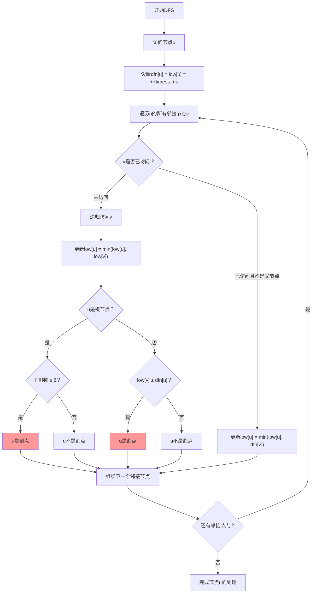

# 🌸 Tarjan算法求割点详解
## *千禧年科技学院 - アリス图论专题*

*"割点是图论中的重要概念，Tarjan算法让我们能够高效地找到所有关键节点！"*

---

## 📚 目录

1. [割点的基本概念](#割点的基本概念)
2. [Tarjan算法原理](#tarjan算法原理)
3. [算法实现详解](#算法实现详解)
4. [复杂度分析](#复杂度分析)
5. [经典例题解析](#经典例题解析)
6. [实际应用场景](#实际应用场景)
7. [常见错误与调试](#常见错误与调试)

---

## 🎯 割点的基本概念

### 定义

**割点（关节点，Articulation Point）**：在无向连通图中，如果删除某个顶点及其关联的所有边后，图的连通分量数增加，则该顶点称为割点。

### 🌟 重要性质

#### 性质 1：根节点的割点判定
对于DFS树的根节点，当且仅当它有**两个或更多子树**时，它才是割点。

#### 性质 2：非根节点的割点判定
对于DFS树的非根节点u，当且仅当存在子节点v使得**low[v] ≥ dfn[u]**时，u才是割点。

### 🔍 直观理解

```
原图：
A --- B --- C
|     |     |
D --- E --- F

删除节点B后：
A     C
|     |
D     F
    E

结果：图分成了3个连通分量，所以B是割点
```

---

## 🚀 Tarjan算法原理

### 核心思想

Tarjan求割点算法基于DFS树，利用**时间戳**和**追溯值**来判断节点是否为割点：

- **dfn[u]**：节点u的DFS访问时间戳
- **low[u]**：从u或u的子树能够追溯到的最早时间戳

### 🎭 算法关键洞察

#### 对于根节点
```
如果根节点有 ≥ 2 个子树，则根节点是割点
原因：删除根节点后，各子树失去连接
```

#### 对于非根节点u
```
如果存在子节点v使得 low[v] ≥ dfn[u]，则u是割点
原因：v及其子树无法通过其他路径到达u的祖先
```

### 📊 算法流程图



---

## 💻 算法实现详解

### 🌸 完整C++实现

```cpp
#include <bits/stdc++.h>
using namespace std;

class TarjanCutVertex {
private:
    int n;                          // 节点数
    vector<vector<int>> graph;      // 邻接表
    vector<int> dfn, low;          // 时间戳和追溯值
    vector<bool> visited;          // 访问标记
    vector<bool> isCutVertex;      // 是否为割点
    int timestamp;                 // 时间戳计数器
    int root;                      // DFS树根节点
    int rootChildren;              // 根节点子树数量
    
    void tarjan(int u, int parent) {
        visited[u] = true;
        dfn[u] = low[u] = ++timestamp;
        
        // 遍历所有邻接节点
        for (int v : graph[u]) {
            if (v == parent) continue;  // 跳过父节点
            
            if (!visited[v]) {
                // v未被访问，递归访问
                if (u == root) rootChildren++;  // 根节点子树计数
                
                tarjan(v, u);
                
                // 更新追溯值
                low[u] = min(low[u], low[v]);
                
                // 割点判定
                if (u != root && low[v] >= dfn[u]) {
                    isCutVertex[u] = true;
                }
            } else {
                // v已被访问，更新追溯值
                low[u] = min(low[u], dfn[v]);
            }
        }
    }
    
public:
    TarjanCutVertex(int n) : n(n), graph(n + 1), dfn(n + 1, 0), 
                             low(n + 1, 0), visited(n + 1, false), 
                             isCutVertex(n + 1, false), timestamp(0) {}
    
    void addEdge(int u, int v) {
        graph[u].push_back(v);
        graph[v].push_back(u);  // 无向图
    }
    
    void findCutVertices() {
        // 重置状态
        fill(dfn.begin(), dfn.end(), 0);
        fill(low.begin(), low.end(), 0);
        fill(visited.begin(), visited.end(), false);
        fill(isCutVertex.begin(), isCutVertex.end(), false);
        timestamp = 0;
        
        // 处理所有连通分量
        for (int i = 1; i <= n; i++) {
            if (!visited[i]) {
                root = i;
                rootChildren = 0;
                tarjan(i, -1);
                
                // 根节点割点判定
                if (rootChildren >= 2) {
                    isCutVertex[root] = true;
                }
            }
        }
    }
    
    vector<int> getCutVertices() {
        vector<int> result;
        for (int i = 1; i <= n; i++) {
            if (isCutVertex[i]) {
                result.push_back(i);
            }
        }
        return result;
    }
    
    bool isCut(int u) {
        return isCutVertex[u];
    }
    
    void printCutVertices() {
        vector<int> cuts = getCutVertices();
        cout << "割点数量: " << cuts.size() << endl;
        if (!cuts.empty()) {
            cout << "割点列表: ";
            for (int v : cuts) {
                cout << v << " ";
            }
            cout << endl;
        } else {
            cout << "无割点" << endl;
        }
    }
    
    // 调试函数：输出DFS过程
    void debugTarjan(int u, int parent, int depth) {
        string indent(depth * 2, ' ');
        cout << indent << "访问节点 " << u << ": dfn=" << dfn[u] 
             << ", low=" << low[u] << endl;
        
        visited[u] = true;
        dfn[u] = low[u] = ++timestamp;
        
        for (int v : graph[u]) {
            if (v == parent) continue;
            
            cout << indent << "  检查邻接节点 " << v;
            
            if (!visited[v]) {
                cout << " (未访问，递归)" << endl;
                if (u == root) rootChildren++;
                
                debugTarjan(v, u, depth + 1);
                low[u] = min(low[u], low[v]);
                
                cout << indent << "  回溯: low[" << u << "] = " << low[u];
                if (u != root && low[v] >= dfn[u]) {
                    cout << " -> " << u << "是割点!";
                    isCutVertex[u] = true;
                }
                cout << endl;
            } else {
                cout << " (已访问)" << endl;
                low[u] = min(low[u], dfn[v]);
                cout << indent << "  更新: low[" << u << "] = " << low[u] << endl;
            }
        }
    }
};

// 简化版全局变量实现
namespace SimpleTarjan {
    const int MAXN = 100005;
    vector<int> graph[MAXN];
    int dfn[MAXN], low[MAXN], timestamp_cnt;
    bool visited[MAXN], is_cut[MAXN];
    int root, root_children;
    
    void tarjan(int u, int parent) {
        visited[u] = true;
        dfn[u] = low[u] = ++timestamp_cnt;
        
        for (int v : graph[u]) {
            if (v == parent) continue;
            
            if (!visited[v]) {
                if (u == root) root_children++;
                
                tarjan(v, u);
                low[u] = min(low[u], low[v]);
                
                if (u != root && low[v] >= dfn[u]) {
                    is_cut[u] = true;
                }
            } else {
                low[u] = min(low[u], dfn[v]);
            }
        }
    }
    
    void findCutVertices(int n) {
        // 初始化
        timestamp_cnt = 0;
        for (int i = 1; i <= n; i++) {
            dfn[i] = low[i] = 0;
            visited[i] = is_cut[i] = false;
        }
        
        // 处理所有连通分量
        for (int i = 1; i <= n; i++) {
            if (!visited[i]) {
                root = i;
                root_children = 0;
                tarjan(i, -1);
                
                if (root_children >= 2) {
                    is_cut[root] = true;
                }
            }
        }
    }
}
```

### 🎯 关键代码解析

#### 1. 时间戳和追溯值初始化
```cpp
dfn[u] = low[u] = ++timestamp;
```
每个节点首次访问时，其追溯值等于时间戳。

#### 2. 追溯值更新规则
```cpp
if (!visited[v]) {
    tarjan(v, u);
    low[u] = min(low[u], low[v]);  // 子树信息回传
} else {
    low[u] = min(low[u], dfn[v]);  // 后向边更新
}
```

#### 3. 割点判定条件
```cpp
// 非根节点判定
if (u != root && low[v] >= dfn[u]) {
    isCutVertex[u] = true;
}

// 根节点判定（在DFS结束后）
if (rootChildren >= 2) {
    isCutVertex[root] = true;
}
```

---

## 📊 算法执行示例

### 示例图

```
图的结构：
    1
   / \
  2   3
 /   / \
4   5   6
    |
    7
```

### 邻接表表示
```
1: [2, 3]
2: [1, 4]
3: [1, 5, 6]
4: [2]
5: [3, 7]
6: [3]
7: [5]
```

### DFS执行过程

| 步骤 | 访问节点 | dfn | low | 父节点 | 操作 | 割点判定 |
|------|----------|-----|-----|--------|------|----------|
| 1 | 1(根) | 1 | 1 | - | 开始DFS | - |
| 2 | 2 | 2 | 2 | 1 | 访问1的子节点 | - |
| 3 | 4 | 3 | 3 | 2 | 访问2的子节点 | - |
| 4 | - | - | 3 | - | 回溯到2 | low[4]=3≥dfn[2]=2, 2是割点 |
| 5 | - | - | 2 | - | 回溯到1 | low[2]=2≥dfn[1]=1 |
| 6 | 3 | 4 | 4 | 1 | 访问1的另一子节点 | - |
| 7 | 5 | 5 | 5 | 3 | 访问3的子节点 | - |
| 8 | 7 | 6 | 6 | 5 | 访问5的子节点 | - |
| 9 | - | - | 6 | - | 回溯到5 | low[7]=6≥dfn[5]=5, 5是割点 |
| 10 | - | - | 5 | - | 回溯到3 | low[5]=5≥dfn[3]=4, 3是割点 |
| 11 | 6 | 7 | 7 | 3 | 访问3的另一子节点 | - |
| 12 | - | - | 7 | - | 回溯到3 | low[6]=7≥dfn[3]=4 |
| 13 | - | - | 4 | - | 回溯到1 | 根节点有2个子树 |

### 最终结果
- **割点**: {1, 2, 3, 5}
- **非割点**: {4, 6, 7}

### 验证正确性
- 删除节点1：图分成两部分 {2,4} 和 {3,5,6,7} ✓
- 删除节点2：图分成两部分 {1,3,5,6,7} 和 {4} ✓
- 删除节点3：图分成三部分 {1,2,4}、{5,7} 和 {6} ✓
- 删除节点5：图分成两部分 {1,2,3,4,6} 和 {7} ✓

---

## ⚡ 复杂度分析

### 时间复杂度
- **DFS遍历**: O(V + E) - 每个顶点和边都被访问一次
- **割点判定**: O(1) - 每次判定都是常数时间
- **总时间复杂度**: **O(V + E)**

### 空间复杂度
- **邻接表**: O(V + E) - 存储图结构
- **DFS辅助数组**: O(V) - dfn, low, visited等
- **递归栈**: O(V) - 最坏情况下递归深度为V
- **总空间复杂度**: **O(V + E)**

### 与暴力算法对比

| 算法 | 时间复杂度 | 空间复杂度 | 实现难度 |
|------|------------|------------|----------|
| **Tarjan算法** | O(V + E) | O(V + E) | 中等 |
| **暴力算法** | O(V × (V + E)) | O(V + E) | 简单 |

暴力算法需要对每个节点都执行一次DFS/BFS来检查连通性，效率远低于Tarjan算法。

---

## 🏆 经典例题解析

### 例题1：基础割点求解

**题目描述**: 给定一个无向连通图，求出所有割点。

**输入格式**:
```
第一行：n(顶点数) m(边数)
接下来m行：每行两个整数u v，表示u和v之间有一条边
```

**解题代码**:
```cpp
#include <bits/stdc++.h>
using namespace std;

int main() {
    int n, m;
    cin >> n >> m;
    
    TarjanCutVertex tarjan(n);
    
    for (int i = 0; i < m; i++) {
        int u, v;
        cin >> u >> v;
        tarjan.addEdge(u, v);
    }
    
    tarjan.findCutVertices();
    tarjan.printCutVertices();
    
    return 0;
}
```

### 例题2：洛谷P3388 - 割点（关节点）

**题目链接**: https://www.luogu.com.cn/problem/P3388

**题目要求**: 输出所有割点，按编号从小到大排序。

**关键要点**:
1. 输出格式要求按编号排序
2. 需要特别注意孤立点的处理
3. 可能存在重边和自环

**完整解题代码**:
```cpp
#include <bits/stdc++.h>
using namespace std;

const int MAXN = 100005;
vector<int> graph[MAXN];
int dfn[MAXN], low[MAXN], timestamp_cnt;
bool visited[MAXN], is_cut[MAXN];
int root, root_children;

void tarjan(int u, int parent) {
    visited[u] = true;
    dfn[u] = low[u] = ++timestamp_cnt;
    
    for (int v : graph[u]) {
        if (v == parent) continue;  // 跳过父节点（处理重边）
        
        if (!visited[v]) {
            if (u == root) root_children++;
            
            tarjan(v, u);
            low[u] = min(low[u], low[v]);
            
            if (u != root && low[v] >= dfn[u]) {
                is_cut[u] = true;
            }
        } else {
            low[u] = min(low[u], dfn[v]);
        }
    }
}

int main() {
    ios::sync_with_stdio(false);
    cin.tie(0);
    
    int n, m;
    cin >> n >> m;
    
    for (int i = 0; i < m; i++) {
        int u, v;
        cin >> u >> v;
        if (u == v) continue;  // 忽略自环
        graph[u].push_back(v);
        graph[v].push_back(u);
    }
    
    // 初始化
    timestamp_cnt = 0;
    for (int i = 1; i <= n; i++) {
        dfn[i] = low[i] = 0;
        visited[i] = is_cut[i] = false;
    }
    
    // 处理所有连通分量
    for (int i = 1; i <= n; i++) {
        if (!visited[i]) {
            root = i;
            root_children = 0;
            tarjan(i, -1);
            
            if (root_children >= 2) {
                is_cut[root] = true;
            }
        }
    }
    
    // 输出结果
    vector<int> result;
    for (int i = 1; i <= n; i++) {
        if (is_cut[i]) {
            result.push_back(i);
        }
    }
    
    cout << result.size() << "\n";
    for (int i = 0; i < result.size(); i++) {
        if (i > 0) cout << " ";
        cout << result[i];
    }
    if (!result.empty()) cout << "\n";
    
    return 0;
}
```

### 例题3：网络关键节点分析

**问题描述**: 在一个通信网络中，找出所有关键节点，这些节点的故障会导致网络分割。

**建模方法**:
1. 将通信节点建模为图的顶点
2. 将通信链路建模为图的边
3. 关键节点即为图的割点

**扩展应用**:
- 网络可靠性分析
- 交通枢纽识别
- 社交网络关键人物发现

---

## 🌐 实际应用场景

### 1. 网络拓扑分析
```cpp
class NetworkAnalyzer {
private:
    TarjanCutVertex tarjan;
    map<string, int> nodeMap;
    vector<string> nodeNames;
    
public:
    void addNode(const string& name) {
        if (nodeMap.find(name) == nodeMap.end()) {
            nodeMap[name] = nodeNames.size() + 1;
            nodeNames.push_back(name);
        }
    }
    
    void addConnection(const string& node1, const string& node2) {
        addNode(node1);
        addNode(node2);
        tarjan.addEdge(nodeMap[node1], nodeMap[node2]);
    }
    
    vector<string> findCriticalNodes() {
        tarjan.findCutVertices();
        vector<int> cutVertices = tarjan.getCutVertices();
        
        vector<string> result;
        for (int v : cutVertices) {
            result.push_back(nodeNames[v - 1]);
        }
        return result;
    }
};
```

### 2. 交通网络分析
- **问题**: 找出交通网络中的关键交叉点
- **方法**: 将路口建模为节点，道路建模为边，使用Tarjan算法找割点
- **意义**: 确定需要重点保护或改进的交通节点

### 3. 社交网络分析
- **问题**: 识别社交网络中的关键人物
- **方法**: 人员为节点，关系为边，割点代表关键连接者
- **应用**: 意见领袖识别、信息传播分析

### 4. 生物网络分析
- **问题**: 找出蛋白质网络中的关键蛋白
- **方法**: 蛋白质为节点，相互作用为边
- **意义**: 药物靶点发现、疾病机理研究

---

## 🚨 常见错误与调试

### 常见错误类型

#### 1. 父节点处理错误
```cpp
// ❌ 错误：没有跳过父节点
for (int v : graph[u]) {
    if (!visited[v]) {
        // 处理逻辑
    }
}

// ✅ 正确：必须跳过父节点
for (int v : graph[u]) {
    if (v == parent) continue;  // 关键步骤
    if (!visited[v]) {
        // 处理逻辑
    }
}
```

#### 2. 根节点判定错误
```cpp
// ❌ 错误：根节点也用统一判定条件
if (low[v] >= dfn[u]) {
    is_cut[u] = true;
}

// ✅ 正确：根节点需要特殊处理
if (u != root && low[v] >= dfn[u]) {
    is_cut[u] = true;
}
// 根节点在DFS结束后单独判定
```

#### 3. 重边和自环处理
```cpp
// ❌ 错误：没有处理重边
tarjan.addEdge(u, v);

// ✅ 正确：需要处理特殊情况
if (u == v) continue;  // 忽略自环
// 或者在遍历时跳过父节点来处理重边
```

### 调试技巧

#### 1. 输出中间状态
```cpp
void debugPrint(int u) {
    cout << "节点 " << u << ": dfn=" << dfn[u] 
         << ", low=" << low[u] 
         << ", 是否割点=" << is_cut[u] << endl;
}
```

#### 2. 验证结果正确性
```cpp
bool verifyCutVertex(int n, int cutVertex) {
    // 临时删除割点，检查连通分量数是否增加
    // 这里可以实现一个简单的验证逻辑
    return true;  // 简化实现
}
```

#### 3. 可视化DFS过程
```cpp
void visualizeDFS(int u, int depth) {
    string indent(depth * 2, ' ');
    cout << indent << "访问: " << u << " [" << dfn[u] << "," << low[u] << "]";
    if (is_cut[u]) cout << " <割点>";
    cout << endl;
}
```

### 测试用例设计

#### 测试用例1：基本情况
```
输入:
5 5
1 2
2 3
3 4
4 5
2 4

期望输出: 割点{2, 4}
```

#### 测试用例2：根节点为割点
```
输入:
4 3
1 2
1 3
1 4

期望输出: 割点{1}
```

#### 测试用例3：无割点
```
输入:
4 6
1 2
2 3
3 4
4 1
1 3
2 4

期望输出: 无割点
```

#### 测试用例4：多连通分量
```
输入:
6 4
1 2
2 3
4 5
5 6

期望输出: 割点{2, 5}
```

---

## 💡 算法优化与扩展

### 性能优化

#### 1. 内存优化
```cpp
// 使用更紧凑的数据结构
struct Edge {
    int to, next;
};
Edge edges[MAXM];
int head[MAXN], edge_count;

void addEdge(int u, int v) {
    edges[++edge_count] = {v, head[u]};
    head[u] = edge_count;
    edges[++edge_count] = {u, head[v]};
    head[v] = edge_count;
}
```

#### 2. 缓存友好的遍历
```cpp
// 预排序邻接表以提高缓存命中率
for (int i = 1; i <= n; i++) {
    sort(graph[i].begin(), graph[i].end());
}
```

### 算法扩展

#### 1. 求桥（割边）
```cpp
void findBridges(int u, int parent) {
    dfn[u] = low[u] = ++timestamp_cnt;
    
    for (int v : graph[u]) {
        if (v == parent) continue;
        
        if (!dfn[v]) {
            findBridges(v, u);
            low[u] = min(low[u], low[v]);
            
            // 桥的判定条件
            if (low[v] > dfn[u]) {
                bridges.push_back({u, v});
            }
        } else {
            low[u] = min(low[u], dfn[v]);
        }
    }
}
```

#### 2. 求点双连通分量
```cpp
void findVertexBCC(int u, int parent) {
    dfn[u] = low[u] = ++timestamp_cnt;
    st.push(u);
    
    for (int v : graph[u]) {
        if (v == parent) continue;
        
        if (!dfn[v]) {
            findVertexBCC(v, u);
            low[u] = min(low[u], low[v]);
            
            if (low[v] >= dfn[u]) {
                // 找到一个点双连通分量
                vector<int> bcc;
                int w;
                do {
                    w = st.top();
                    st.pop();
                    bcc.push_back(w);
                } while (w != v);
                bcc.push_back(u);
                vertex_bccs.push_back(bcc);
            }
        } else {
            low[u] = min(low[u], dfn[v]);
        }
    }
}
```

---

## 🎓 学习建议与总结

### 🌟 掌握要点

1. **理解概念**：深刻理解割点的定义和意义
2. **掌握原理**：熟悉DFS树和追溯值的计算方法
3. **注意细节**：根节点和非根节点的不同判定条件
4. **处理特例**：重边、自环、多连通分量的正确处理
5. **实际应用**：能够将实际问题抽象为图论模型

### 📚 推荐练习题

#### 入门级
1. **洛谷P3388** - 割点（模板题）
2. **HDU2553** - N皇后问题的图论建模
3. **POJ1144** - Network（基础割点应用）

#### 进阶级
1. **洛谷P2860** - 冗余路径（结合桥的概念）
2. **SPOJ SUBLEX** - 后缀自动机+割点
3. **Codeforces 700E** - Cool Slogans

#### 挑战级
1. **ICPC WF 2018** - Circular DNA
2. **洛谷P4630** - 图的序列
3. **AtCoder AGC044E** - Random Pebbling

### 🚀 进阶方向

1. **桥和边双连通分量**：扩展到边连通性分析
2. **圆方树**：处理仙人掌图的高级数据结构
3. **动态图连通性**：支持边的插入删除操作
4. **平面图的特殊性质**：利用平面图的特殊结构优化算法

### 💎 算法之美

Tarjan算法的优雅之处在于：
- 🎯 **一次遍历**：仅需一次DFS即可找到所有割点
- 🔧 **线性时间**：时间复杂度为O(V+E)，达到理论最优
- 🎨 **设计精妙**：巧妙利用DFS树的性质和追溯值
- 🌐 **应用广泛**：从网络分析到生物信息学都有重要应用

---

<div align="center">

### 🌸 特别鸣谢

**感谢千禧年科技学院图论研究小组！**

> *"Tarjan算法展现了图论的深刻洞察力，它不仅解决了割点问题，更为我们提供了分析图连通性的强大工具。掌握这个算法，你就掌握了图论的一把利剑！"*
>
> — **アリス会长**

*🌸 在图论的世界里，每一个算法都是一首优美的诗！*

</div> 