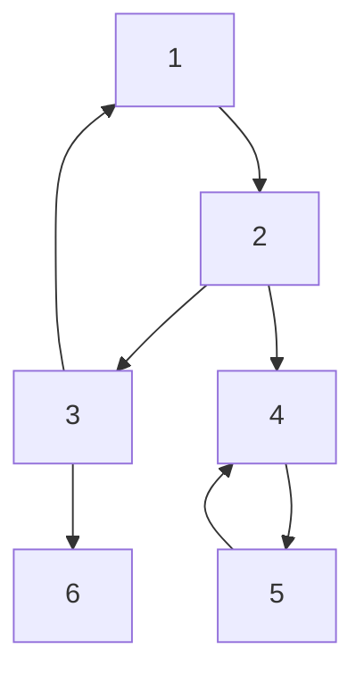

# Tarjan算法详解 - 强连通分量求解的经典算法

## 📚 算法背景

**Tarjan算法**由美国计算机科学家Robert Tarjan于1972年提出，是求解有向图强连通分量的经典算法之一。该算法基于深度优先搜索(DFS)，具有线性时间复杂度O(V+E)，是目前最高效的强连通分量求解算法之一。

### 🎯 核心概念

#### 强连通分量 (Strongly Connected Component, SCC)
在有向图G中，如果从顶点v能够到达顶点u，同时从顶点u也能够到达顶点v，则称v和u**强连通**。在有向图中，**强连通分量**是一个最大的顶点集合，其中任意两个顶点都是强连通的。

#### 时间戳与追溯值
- **时间戳 dfn[u]**：节点u在DFS中被首次访问的时间
- **追溯值 low[u]**：从节点u出发，通过DFS能够到达的所有节点中，时间戳的最小值

## 🧠 算法原理

### 核心思想

Tarjan算法的核心思想是：**当且仅当 dfn[u] = low[u] 时，节点u是某个强连通分量的根节点**。

### 算法流程

1. **DFS遍历**：按DFS顺序访问图中的每个节点
2. **时间戳记录**：记录每个节点的访问时间 dfn[u]
3. **追溯值更新**：计算每个节点的追溯值 low[u]
4. **栈维护**：使用栈维护当前路径上的节点
5. **SCC识别**：当 dfn[u] = low[u] 时，识别出一个强连通分量

### 追溯值更新规则

对于节点u的每个邻接节点v：

```
if v未被访问:
    递归访问v
    low[u] = min(low[u], low[v])
else if v在栈中:
    low[u] = min(low[u], dfn[v])
```

## 📊 算法可视化演示

让我们通过一个具体例子来理解Tarjan算法的执行过程：

### 示例图



### 执行过程

| 步骤 | 访问节点 | dfn | low | 栈状态 | 操作 |
|------|----------|-----|-----|--------|------|
| 1 | 1 | 1 | 1 | [1] | 访问节点1 |
| 2 | 2 | 2 | 2 | [1,2] | 访问节点2 |
| 3 | 3 | 3 | 3 | [1,2,3] | 访问节点3 |
| 4 | - | - | - | [1,2,3] | 3→1，1在栈中，low[3]=min(3,1)=1 |
| 5 | - | - | - | [1,2,3] | 回溯到3，low[2]=min(2,1)=1 |
| 6 | 4 | 4 | 4 | [1,2,3,4] | 访问节点4 |
| 7 | 5 | 5 | 5 | [1,2,3,4,5] | 访问节点5 |
| 8 | - | - | - | [1,2,3,4,5] | 5→4，4在栈中，low[5]=min(5,4)=4 |
| 9 | - | - | - | [1,2,3,4] | dfn[5]=low[5]≠4，回溯，弹出5，SCC:{5} |
| 10 | - | - | - | [1,2,3] | dfn[4]=low[4]=4，弹出4，SCC:{4,5} |
| 11 | 6 | 6 | 6 | [1,2,3,6] | 访问节点6 |
| 12 | - | - | - | [1,2,3] | dfn[6]=low[6]=6，弹出6，SCC:{6} |
| 13 | - | - | - | [] | dfn[3]=low[3]=1，弹出1,2,3，SCC:{1,2,3} |

## 💻 完整代码实现

### C++模板代码

```cpp
#include <iostream>
#include <vector>
#include <stack>
#include <algorithm>
using namespace std;

class TarjanSCC {
private:
    int n;                          // 节点数
    vector<vector<int>> graph;      // 邻接表
    vector<int> dfn, low;          // 时间戳和追溯值
    vector<bool> inStack;          // 是否在栈中
    stack<int> st;                 // DFS栈
    vector<vector<int>> sccs;      // 存储所有强连通分量
    int timestamp;                 // 时间戳计数器
    
    void tarjan(int u) {
        // 初始化当前节点
        dfn[u] = low[u] = ++timestamp;
        st.push(u);
        inStack[u] = true;
        
        // 遍历所有邻接节点
        for (int v : graph[u]) {
            if (dfn[v] == 0) {
                // v未被访问，递归访问
                tarjan(v);
                low[u] = min(low[u], low[v]);
            } else if (inStack[v]) {
                // v在栈中，说明存在回边
                low[u] = min(low[u], dfn[v]);
            }
        }
        
        // 如果u是强连通分量的根节点
        if (dfn[u] == low[u]) {
            vector<int> scc;
            int v;
            do {
                v = st.top();
                st.pop();
                inStack[v] = false;
                scc.push_back(v);
            } while (v != u);
            
            sccs.push_back(scc);
        }
    }
    
public:
    TarjanSCC(int n) : n(n), graph(n + 1), dfn(n + 1, 0), 
                       low(n + 1, 0), inStack(n + 1, false), timestamp(0) {}
    
    void addEdge(int u, int v) {
        graph[u].push_back(v);
    }
    
    void findSCC() {
        for (int i = 1; i <= n; i++) {
            if (dfn[i] == 0) {
                tarjan(i);
            }
        }
    }
    
    void printSCCs() {
        cout << "强连通分量数量: " << sccs.size() << endl;
        for (int i = 0; i < sccs.size(); i++) {
            cout << "SCC " << i + 1 << ": ";
            for (int v : sccs[i]) {
                cout << v << " ";
            }
            cout << endl;
        }
    }
    
    vector<vector<int>> getSCCs() {
        return sccs;
    }
};

// 使用示例
int main() {
    int n = 6; // 节点数
    TarjanSCC tarjan(n);
    
    // 添加边
    tarjan.addEdge(1, 2);
    tarjan.addEdge(2, 3);
    tarjan.addEdge(3, 1);
    tarjan.addEdge(2, 4);
    tarjan.addEdge(4, 5);
    tarjan.addEdge(5, 4);
    tarjan.addEdge(3, 6);
    
    // 求解强连通分量
    tarjan.findSCC();
    
    // 输出结果
    tarjan.printSCCs();
    
    return 0;
}
```

### 简化版模板

```cpp
const int MAXN = 100005;
vector<int> graph[MAXN];
int dfn[MAXN], low[MAXN], timestamp_cnt;
bool inStack[MAXN];
stack<int> st;
vector<vector<int>> sccs;

void tarjan(int u) {
    dfn[u] = low[u] = ++timestamp_cnt;
    st.push(u);
    inStack[u] = true;
    
    for (int v : graph[u]) {
        if (!dfn[v]) {
            tarjan(v);
            low[u] = min(low[u], low[v]);
        } else if (inStack[v]) {
            low[u] = min(low[u], dfn[v]);
        }
    }
    
    if (dfn[u] == low[u]) {
        vector<int> scc;
        int v;
        do {
            v = st.top();
            st.pop();
            inStack[v] = false;
            scc.push_back(v);
        } while (v != u);
        sccs.push_back(scc);
    }
}
```

## 🎯 经典应用场景

### 1. 强连通分量求解
- **问题**：求有向图中所有强连通分量
- **应用**：网络分析、社交网络分群等

### 2. 差分约束系统
- **问题**：求解一组差分不等式的可行解
- **方法**：建图后用Tarjan检测正环
- **例题**：洛谷P3275 糖果分配问题

### 3. 2-SAT问题
- **问题**：判断布尔表达式的可满足性
- **方法**：建立蕴含图后求强连通分量
- **应用**：逻辑电路设计、约束满足问题

### 4. 缩点构建DAG
- **问题**：将强连通分量缩为单点构建DAG
- **应用**：拓扑排序、最长路径问题

## 📝 经典例题详解

### 例题1：洛谷P2863 - 牛的舞会

**题目描述**：给定一个有向图，求其中包含节点数大于1的强连通分量的个数。

**解题思路**：
1. 使用Tarjan算法求出所有强连通分量
2. 统计大小大于1的强连通分量个数

**代码实现**：
```cpp
#include <iostream>
#include <vector>
#include <stack>
using namespace std;

// Tarjan算法求强连通分量
void solve() {
    int n, m;
    cin >> n >> m;
    
    TarjanSCC tarjan(n);
    for (int i = 0; i < m; i++) {
        int u, v;
        cin >> u >> v;
        tarjan.addEdge(u, v);
    }
    
    tarjan.findSCC();
    vector<vector<int>> sccs = tarjan.getSCCs();
    
    int count = 0;
    for (auto& scc : sccs) {
        if (scc.size() > 1) {
            count++;
        }
    }
    
    cout << count << endl;
}
```

### 例题2：强连通分量缩点

**题目描述**：给定有向图，求缩点后DAG中的节点数。

**解题思路**：
1. 求出所有强连通分量
2. 每个强连通分量对应缩点后DAG中的一个节点

```cpp
void buildDAG() {
    // 假设已经求出强连通分量并存储在sccs中
    int scc_count = sccs.size();
    vector<int> scc_id(n + 1); // 记录每个节点属于哪个强连通分量
    
    // 为每个节点分配强连通分量编号
    for (int i = 0; i < scc_count; i++) {
        for (int v : sccs[i]) {
            scc_id[v] = i;
        }
    }
    
    // 构建新图
    vector<set<int>> new_graph(scc_count);
    for (int u = 1; u <= n; u++) {
        for (int v : graph[u]) {
            if (scc_id[u] != scc_id[v]) {
                new_graph[scc_id[u]].insert(scc_id[v]);
            }
        }
    }
    
    cout << "DAG节点数: " << scc_count << endl;
}
```

## ⚡ 性能分析与优化

### 时间复杂度
- **DFS遍历**：O(V+E) - 每个节点和边都被访问一次
- **栈操作**：O(V) - 每个节点最多入栈出栈一次
- **总复杂度**：**O(V+E)**

### 空间复杂度
- **数组存储**：O(V) - dfn, low, inStack数组
- **栈空间**：O(V) - 最坏情况下所有节点都在栈中
- **递归深度**：O(V) - DFS递归栈深度
- **总复杂度**：**O(V)**

### 常见优化技巧

#### 1. 避免栈溢出
```cpp
// 对于超大图，可以使用显式栈避免递归栈溢出
void iterativeTarjan(int start) {
    stack<pair<int, int>> dfs_stack; // (节点, 状态)
    dfs_stack.push({start, 0});
    
    while (!dfs_stack.empty()) {
        auto [u, state] = dfs_stack.top();
        dfs_stack.pop();
        
        if (state == 0) {
            // 首次访问节点u
            if (dfn[u] != 0) continue;
            
            dfn[u] = low[u] = ++timestamp_cnt;
            st.push(u);
            inStack[u] = true;
            
            // 压入状态1，准备处理邻接节点
            dfs_stack.push({u, 1});
            
            // 压入所有邻接节点
            for (int v : graph[u]) {
                dfs_stack.push({v, 0});
            }
        } else {
            // 处理完所有邻接节点，检查是否为SCC根
            // ... 处理逻辑
        }
    }
}
```

#### 2. 内存优化
```cpp
// 对于稠密图，可以使用邻接矩阵
class TarjanMatrix {
private:
    vector<vector<bool>> adj;
    // ... 其他成员变量
    
public:
    void addEdge(int u, int v) {
        adj[u][v] = true;
    }
    
    void tarjan(int u) {
        // ... 初始化
        
        for (int v = 1; v <= n; v++) {
            if (adj[u][v]) {
                // 处理边u->v
            }
        }
        
        // ... 其余逻辑
    }
};
```

## 🚨 常见错误与调试技巧

### 常见错误

#### 1. 时间戳初始化错误
```cpp
// ❌ 错误：时间戳从0开始
int timestamp_cnt = 0;

// ✅ 正确：时间戳从1开始，0表示未访问
int timestamp_cnt = 0;
dfn[u] = low[u] = ++timestamp_cnt; // 先递增再赋值
```

#### 2. 栈状态管理错误
```cpp
// ❌ 错误：忘记标记inStack
st.push(u);
// inStack[u] = true; // 忘记设置

// ✅ 正确：必须同时设置栈状态
st.push(u);
inStack[u] = true;
```

#### 3. 回边判断错误
```cpp
// ❌ 错误：所有已访问节点都更新low值
if (dfn[v] != 0) {
    low[u] = min(low[u], dfn[v]); // 错误
}

// ✅ 正确：只有栈中节点才更新low值
if (dfn[v] != 0 && inStack[v]) {
    low[u] = min(low[u], dfn[v]); // 正确
}
```

### 调试技巧

#### 1. 输出中间状态
```cpp
void debugTarjan(int u) {
    cout << "Visit " << u << ": dfn=" << dfn[u] << ", low=" << low[u] << endl;
    
    // 输出当前栈状态
    stack<int> temp = st;
    cout << "Stack: ";
    while (!temp.empty()) {
        cout << temp.top() << " ";
        temp.pop();
    }
    cout << endl;
}
```

#### 2. 验证结果正确性
```cpp
void validateSCC(const vector<vector<int>>& sccs) {
    // 检查是否所有节点都被分配到某个强连通分量
    vector<bool> visited(n + 1, false);
    for (const auto& scc : sccs) {
        for (int v : scc) {
            if (visited[v]) {
                cout << "错误：节点" << v << "出现在多个强连通分量中" << endl;
            }
            visited[v] = true;
        }
    }
    
    for (int i = 1; i <= n; i++) {
        if (!visited[i]) {
            cout << "错误：节点" << i << "未被分配到任何强连通分量" << endl;
        }
    }
}
```

## 📚 相关算法对比

### Tarjan vs Kosaraju

| 特征 | Tarjan算法 | Kosaraju算法 |
|------|------------|--------------|
| **时间复杂度** | O(V+E) | O(V+E) |
| **空间复杂度** | O(V) | O(V) |
| **DFS次数** | 1次 | 2次 |
| **实现难度** | 中等 | 简单 |
| **常数因子** | 较小 | 较大 |
| **适用场景** | 在线算法，实时性要求高 | 离线算法，易于理解 |

### Kosaraju算法简介

```cpp
void kosaraju() {
    // 第一次DFS，记录完成时间
    stack<int> finish_order;
    vector<bool> visited(n + 1, false);
    
    function<void(int)> dfs1 = [&](int u) {
        visited[u] = true;
        for (int v : graph[u]) {
            if (!visited[v]) {
                dfs1(v);
            }
        }
        finish_order.push(u);
    };
    
    for (int i = 1; i <= n; i++) {
        if (!visited[i]) {
            dfs1(i);
        }
    }
    
    // 第二次DFS，在转置图上按完成时间逆序访问
    fill(visited.begin(), visited.end(), false);
    vector<vector<int>> sccs;
    
    function<void(int, vector<int>&)> dfs2 = [&](int u, vector<int>& scc) {
        visited[u] = true;
        scc.push_back(u);
        for (int v : reverse_graph[u]) {
            if (!visited[v]) {
                dfs2(v, scc);
            }
        }
    };
    
    while (!finish_order.empty()) {
        int u = finish_order.top();
        finish_order.pop();
        
        if (!visited[u]) {
            vector<int> scc;
            dfs2(u, scc);
            sccs.push_back(scc);
        }
    }
}
```

## 🎓 练习题推荐

### 入门级
1. **洛谷P2863** - 牛的舞会 (强连通分量计数)
2. **POJ2186** - Popular Cows (强连通分量+拓扑)
3. **HDU1269** - 迷宫城堡 (强连通图判断)

### 进阶级
1. **洛谷P3275** - 糖果 (差分约束+Tarjan)
2. **洛谷P2341** - 受欢迎的牛 (强连通分量+统计)
3. **SPOJ SUBLEX** - Lexicographical Substring Search

### 挑战级
1. **洛谷P4819** - [中山市选2007]杀手 (2-SAT)
2. **Codeforces 1394D** - Parallel Universes (动态强连通分量)
3. **ICPC WF 2019** - Circular DNA (复杂图论建模)

## 🏆 总结

Tarjan算法是图论中的经典算法，具有以下特点：

### 优势
- ✅ **线性时间复杂度**：O(V+E)，效率极高
- ✅ **一次遍历**：只需一次DFS即可求出所有强连通分量
- ✅ **应用广泛**：强连通分量、2-SAT、差分约束等
- ✅ **实现优雅**：代码简洁，逻辑清晰

### 关键要点
1. **理解核心思想**：dfn[u] = low[u] 是SCC根的充要条件
2. **掌握状态转移**：正确更新low值是算法关键
3. **注意实现细节**：栈状态管理、时间戳初始化等
4. **灵活应用变形**：根据具体问题调整算法框架

掌握Tarjan算法后，您将能够：
- 🎯 高效求解强连通分量问题
- 🎯 处理复杂的图论建模问题
- 🎯 解决差分约束、2-SAT等高级话题
- 🎯 在竞赛中快速识别并解决相关问题

---

*✨ 希望这份详细的Tarjan算法教程能够帮助您深入理解这个强大的图论算法！* 