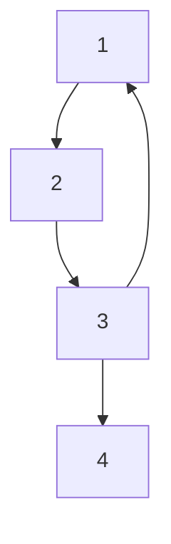
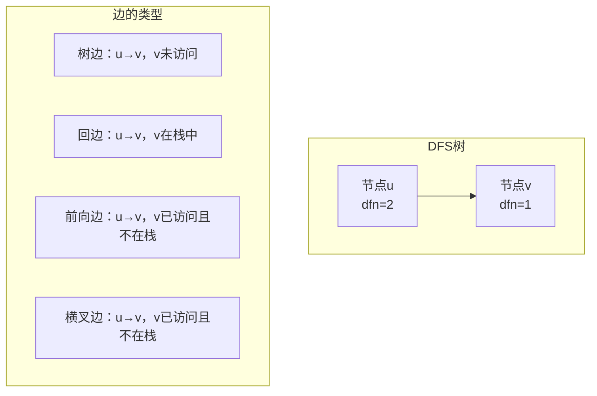

# Tarjan算法核心问题深度分析

## 🤔 关键问题：为什么v在栈中时使用dfn[v]而不是low[v]？

这是理解Tarjan算法最关键的一个问题！让我们深入分析。

## 📊 追溯值更新规则对比

```cpp
// Tarjan算法的追溯值更新规则
for (int v : graph[u]) {
    if (dfn[v] == 0) {
        // 情况1：v未被访问
        tarjan(v);
        low[u] = min(low[u], low[v]);  // ✅ 使用low[v]
    } else if (inStack[v]) {
        // 情况2：v在栈中  
        low[u] = min(low[u], dfn[v]);  // ✅ 使用dfn[v]，为什么？
    }
    // 情况3：v已访问但不在栈中 - 不更新low[u]
}
```

## 🔍 核心原因分析

### 1. low值的定义回顾

**low[u]** = 从节点u出发，通过DFS子树能够到达的**最小时间戳**

### 2. 两种情况的本质区别

#### 情况1：v未被访问时
```
u → v (v未访问)
```
- 递归调用`tarjan(v)`后，v的DFS已经**完全结束**
- `low[v]`是**最终确定的值**，表示从v出发能到达的最小时间戳
- 所以`low[u] = min(low[u], low[v])`是正确的

#### 情况2：v在栈中时
```
u → v (v在栈中)
```
- v在栈中说明v的DFS**还没有结束**
- `low[v]`可能**还会被更新**，不是最终值
- 但`dfn[v]`是确定的，表示v的访问时间

## 🎯 为什么不能使用low[v]？

让我们通过一个具体例子来理解：

### 示例图分析



### DFS执行过程

| 步骤 | 访问节点 | dfn | low | 栈状态 | 操作说明 |
|------|----------|-----|-----|--------|----------|
| 1 | 1 | 1 | 1 | [1] | 访问节点1 |
| 2 | 2 | 2 | 2 | [1,2] | 访问节点2 |
| 3 | 3 | 3 | 3 | [1,2,3] | 访问节点3 |
| 4 | - | - | - | [1,2,3] | **关键时刻**：处理边3→1 |

**关键时刻分析**：
- 当处理边3→1时，节点1在栈中
- 此时`dfn[1] = 1`（确定值）
- 但`low[1]`可能还是1，也可能在后续被更新

### 🚨 如果错误地使用low[v]会怎样？

假设我们错误地写成：
```cpp
else if (inStack[v]) {
    low[u] = min(low[u], low[v]);  // ❌ 错误！
}
```

**问题**：
1. 节点1的DFS还没结束，`low[1]`可能还会变化
2. 我们使用了一个**不稳定的值**来更新`low[3]`
3. 这可能导致算法结果不正确

### ✅ 正确使用dfn[v]的原因

```cpp
else if (inStack[v]) {
    low[u] = min(low[u], dfn[v]);  // ✅ 正确！
}
```

**正确性**：
1. `dfn[v]`是v被访问的时间戳，**永远不会改变**
2. v在栈中说明存在从v到u的路径（v是u的祖先或在同一SCC中）
3. 从u可以通过边到达v，而v的时间戳是`dfn[v]`
4. 所以从u出发能到达的最小时间戳至少是`dfn[v]`

## 🔬 深层原理：DFS树的性质

### DFS树中的边分类



### 关键洞察

当`v在栈中`时，边u→v是**回边**：
- v是u在DFS树中的**祖先节点**
- 存在路径：v → ... → u → v（形成环）
- 这个环表明u和v在**同一个强连通分量**中

此时：
- `low[u]`应该能"回溯"到v的时间戳
- 使用`dfn[v]`是安全的，因为它不会改变
- 使用`low[v]`是不安全的，因为v的DFS还在进行中

## 💡 算法设计的智慧

### 为什么Tarjan如此设计？

1. **稳定性**：使用确定不变的`dfn[v]`而不是可能变化的`low[v]`
2. **正确性**：回边u→v表明能到达时间戳为`dfn[v]`的节点
3. **效率性**：一次DFS遍历就能正确计算所有low值

### 对比其他可能的设计

| 设计方案 | 问题 |
|----------|------|
| 总是使用`low[v]` | v在栈中时，`low[v]`不稳定 |
| 总是使用`dfn[v]` | v未访问时，无法利用v的子树信息 |
| **Tarjan的设计** | ✅ 完美平衡稳定性和信息利用 |

## 🧪 实验验证

让我们通过代码来验证这个设计的必要性：

```cpp
// 错误的实现
void wrongTarjan(int u) {
    dfn[u] = low[u] = ++timestamp_cnt;
    st.push(u);
    inStack[u] = true;
    
    for (int v : graph[u]) {
        if (!dfn[v]) {
            wrongTarjan(v);
            low[u] = min(low[u], low[v]);
        } else if (inStack[v]) {
            low[u] = min(low[u], low[v]);  // ❌ 错误！使用low[v]
        }
    }
    
    // ... 剩余逻辑
}

// 正确的实现  
void correctTarjan(int u) {
    dfn[u] = low[u] = ++timestamp_cnt;
    st.push(u);
    inStack[u] = true;
    
    for (int v : graph[u]) {
        if (!dfn[v]) {
            correctTarjan(v);
            low[u] = min(low[u], low[v]);
        } else if (inStack[v]) {
            low[u] = min(low[u], dfn[v]);  // ✅ 正确！使用dfn[v]
        }
    }
    
    // ... 剩余逻辑
}
```

## 🎓 总结

### 核心要点

1. **v未访问时**：使用`low[v]`，因为v的DFS已完成，`low[v]`是最终值
2. **v在栈中时**：使用`dfn[v]`，因为v的DFS未完成，`low[v]`可能变化
3. **v已访问但不在栈中**：不更新，因为不存在有效路径

### 设计哲学

Tarjan算法的这个设计体现了：
- 🎯 **准确性**：使用确定的值而不是可能变化的值  
- 🔒 **稳定性**：确保算法的确定性行为
- ⚡ **效率性**：一次遍历获得正确结果

这就是为什么Tarjan算法如此优雅和高效的原因！

---

*理解这个细节，你就真正掌握了Tarjan算法的精髓！* 🌟 