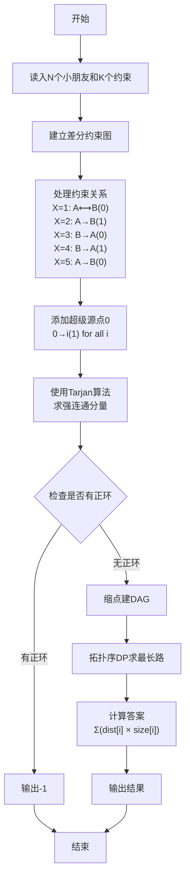
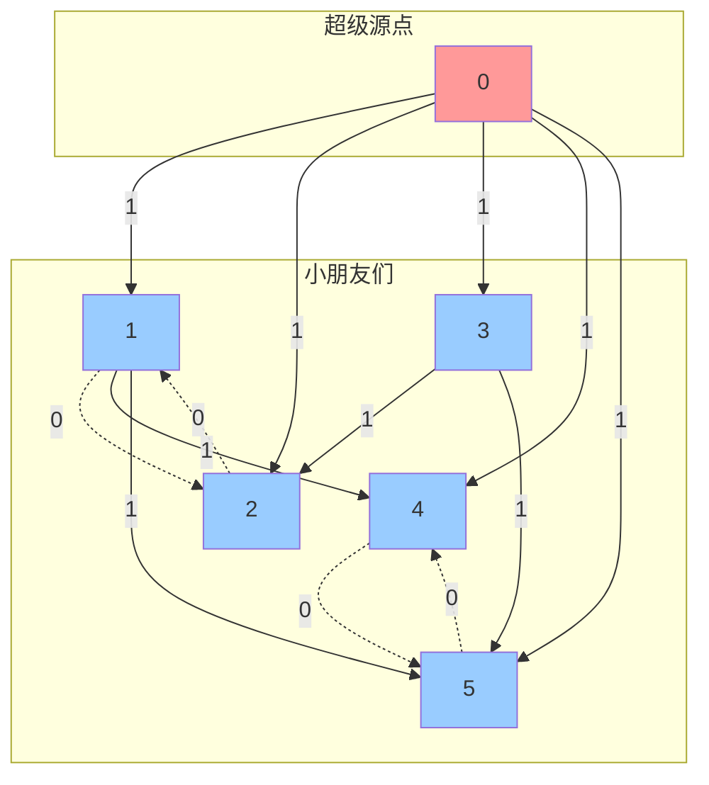
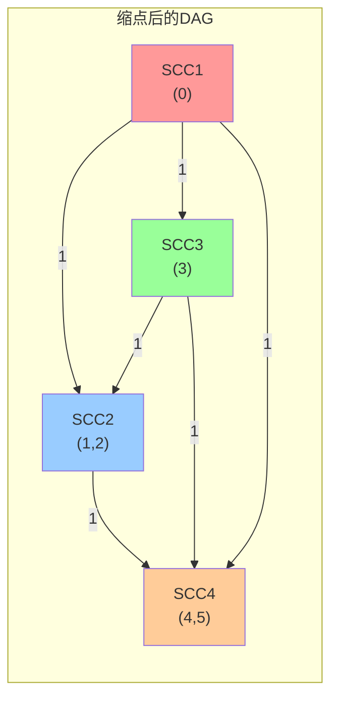

# P3275 [SCOI2011] 糖果 - 差分约束系统详解

## 📝 题目描述

幼儿园里有 **N** 个小朋友，**lxhgww** 老师现在想要给这些小朋友们分配糖果，要求每个小朋友都要分到糖果。

但是小朋友们也有嫉妒心，总是会提出一些要求，比如小明不希望小红分到的糖果比他的多，于是在分配糖果的时候，**lxhgww** 需要满足小朋友们的 **K** 个要求。

幼儿园的糖果总是有限的，**lxhgww** 想知道他至少需要准备多少个糖果，才能使得每个小朋友都能够分到糖果，并且满足小朋友们所有的要求。

## 📋 输入输出格式

### 输入格式
- 第一行：两个整数 **N**, **K**
- 接下来 **K** 行：每行三个数字 **X**, **A**, **B**，表示约束关系

| X值 | 含义 | 数学表示 |
|-----|------|----------|
| 1 | A和B分到的糖果一样多 | `d[A] = d[B]` |
| 2 | A分到的糖果少于B | `d[A] < d[B]` |
| 3 | A分到的糖果不少于B | `d[A] ≥ d[B]` |
| 4 | A分到的糖果多于B | `d[A] > d[B]` |
| 5 | A分到的糖果不多于B | `d[A] ≤ d[B]` |

### 输出格式
- 一行整数：最少需要的糖果总数，无解输出 **-1**

### 样例
```
输入:
5 7
1 1 2
2 3 2
4 4 1
3 4 5
5 4 5
2 3 5
4 5 1

输出:
11
```

## 🧠 算法原理：差分约束系统

### 什么是差分约束系统？

差分约束系统是一组形如 `x[i] - x[j] ≤ c[k]` 的不等式，我们需要求解一组 x 值使得所有不等式都成立。

### 🔄 约束关系转换

设 `d[i]` 表示第 i 个小朋友分到的糖果数量，将题目约束转换为差分约束：

| 原约束 | 差分约束表示 | 图中连边 |
|--------|-------------|----------|
| `d[A] = d[B]` | `d[A]-d[B]≥0` 且 `d[B]-d[A]≥0` | `B→A(0)`, `A→B(0)` |
| `d[A] < d[B]` | `d[B]-d[A]≥1` | `A→B(1)` |
| `d[A] ≥ d[B]` | `d[A]-d[B]≥0` | `B→A(0)` |
| `d[A] > d[B]` | `d[A]-d[B]≥1` | `B→A(1)` |
| `d[A] ≤ d[B]` | `d[B]-d[A]≥0` | `A→B(0)` |

⚠️ **隐含约束**：每个小朋友至少分到1个糖果 → `d[i] ≥ 1` → `d[i]-d[0] ≥ 1`（设置超级源点0）

## 🎯 算法流程详解

### 算法流程图



### 步骤1：建图
- 对于每个约束 `d[x]-d[y] ≥ k`，从节点 y 向节点 x 连一条权值为 k 的有向边
- 设置超级源点 0，从 0 向每个小朋友连权值为 1 的边

### 步骤2：检测正环
- 使用 **Tarjan算法** 求强连通分量
- 如果某个强连通分量内部存在权值为1的边，则存在正环，无解

### 步骤3：缩点建DAG
- 将每个强连通分量缩为一个点
- 在新图上重新连边，得到DAG（有向无环图）

### 步骤4：拓扑序DP求最长路
- 利用Tarjan算法求出的强连通分量编号逆序就是拓扑序
- 在DAG上进行动态规划，求从超级源点到各点的最长路

### 步骤5：计算答案
- 将每个强连通分量的最长路乘以该分量包含的节点数，求和

## 📊 样例详细分析

让我们分析样例：`N=5, K=7`

### 约束分析表

| 序号 | X | A | B | 数学约束 | 建边 |
|------|---|---|---|----------|------|
| 1 | 1 | 1 | 2 | `d[1]=d[2]` | `1→2(0)`, `2→1(0)` |
| 2 | 2 | 3 | 2 | `d[3]<d[2]` | `3→2(1)` |
| 3 | 4 | 4 | 1 | `d[4]>d[1]` | `1→4(1)` |
| 4 | 3 | 4 | 5 | `d[4]≥d[5]` | `5→4(0)` |
| 5 | 5 | 4 | 5 | `d[4]≤d[5]` | `4→5(0)` |
| 6 | 2 | 3 | 5 | `d[3]<d[5]` | `3→5(1)` |
| 7 | 4 | 5 | 1 | `d[5]>d[1]` | `1→5(1)` |

加上超级源点约束：`0→1(1)`, `0→2(1)`, `0→3(1)`, `0→4(1)`, `0→5(1)`

### 约束图可视化



*图例：实线表示权值为1的边，虚线表示权值为0的边*

### 强连通分量分析

通过Tarjan算法，我们可以找到以下强连通分量：
- **SCC1**: {0} （超级源点）
- **SCC2**: {1, 2} （因为存在1⟷2的双向0权边）
- **SCC3**: {3} 
- **SCC4**: {4, 5} （因为存在4⟷5的双向0权边）

### 缩点后的DAG



### 推导过程

通过分析约束关系，我们可以得出：
- 从约束4和5：`d[4] ≥ d[5]` 且 `d[4] ≤ d[5]` → `d[4] = d[5]`
- 从约束1：`d[1] = d[2]`
- 从约束3：`d[4] > d[1]`，结合`d[4] = d[5]` → `d[5] > d[1]`
- 从约束7：`d[5] > d[1]`（与上面一致）
- 从约束2：`d[3] < d[2]`，结合`d[1] = d[2]` → `d[3] < d[1]`
- 从约束6：`d[3] < d[5]`

**最终约束链**：`d[3] < d[1] = d[2] < d[4] = d[5]`

由于每个人至少分到1个糖果：
- `d[3] ≥ 1` → `d[3] = 1`
- `d[1] = d[2] > d[3]` → `d[1] = d[2] = 2`  
- `d[4] = d[5] > d[1]` → `d[4] = d[5] = 3`

**最优解**：`d[1]=2, d[2]=2, d[3]=1, d[4]=3, d[5]=3`  
**总糖果数**：`2+2+1+3+3=11` ✓

## 🔍 关键实现细节

### 1. 数组大小设置
```cpp
const int MAXN = 100005;
const int MAXM = 600005; // 关键：需要开大数组避免WA+TLE
```
由于每个约束可能产生多条边，边数可能达到6倍的K，所以需要开足够大的数组。

### 2. 超级源点设置
```cpp
// 添加超级源点0，每个小朋友至少分到1个糖果
for (int i = 1; i <= n; i++) {
    add(0, i, 1);
}
```
这是保证每个小朋友至少分到1个糖果的关键步骤。

### 3. 特殊情况处理
```cpp
case 2: // d[a] < d[b]
    if (a == b) {
        cout << -1 << endl;
        return 0;
    }
    add(a, b, 1);
    break;
```
当要求自己小于自己或大于自己时，直接输出无解。

### 4. 正环检测
```cpp
if (c[x] == c[y]) {
    // 同一个强连通分量内部有权值为1的边，无解
    if (edge[i] == 1) {
        cout << -1 << endl;
        return 0;
    }
    continue;
}
```
在强连通分量内部，如果存在权值为1的边，说明存在正环。

### 5. 拓扑序DP
```cpp
// 拓扑序DP求最长路
for (int x = cnt; x >= 1; x--) {
    for (int i = hc[x]; i; i = nc[i]) {
        int y = vc[i], z = ec[i];
        dist[y] = max(dist[y], dist[x] + z);
    }
}
```
利用Tarjan算法的性质：强连通分量编号的逆序就是拓扑序。

## 📈 复杂度分析

### 时间复杂度
- **建图阶段**：O(K) - 处理K个约束
- **Tarjan算法**：O(N+M) - 其中M是边数，最多为6K
- **缩点阶段**：O(N+M) - 遍历所有边
- **拓扑序DP**：O(N+M) - 在DAG上进行DP
- **总时间复杂度**：**O(N+K)**

### 空间复杂度
- **邻接表存储**：O(N+M) - 原图和缩点后的图
- **Tarjan算法**：O(N) - dfn, low, 栈等数组
- **总空间复杂度**：**O(N+K)**

## 🚨 常见陷阱与注意事项

### 1. 数组越界问题
```cpp
const int MAXM = 600005; // 必须开足够大，不能只开2*K
```
- 每个X=1约束会产生2条边
- 加上超级源点的N条边
- 实际边数可能达到6K左右

### 2. 自环检测
```cpp
if (a == b) {
    cout << -1 << endl;
    return 0;
}
```
- X=2 (a<b) 和 X=4 (a>b) 当a=b时直接无解

### 3. 正环检测位置
正环检测必须在缩点过程中进行，而不是在建图时：
```cpp
if (c[x] == c[y] && edge[i] == 1) {
    // 强连通分量内部有正权边 → 正环
    cout << -1 << endl;
    return 0;
}
```

### 4. 拓扑序的巧妙利用
不需要额外计算拓扑序，直接利用Tarjan算法的性质：
```cpp
for (int x = cnt; x >= 1; x--) {
    // 强连通分量编号逆序就是拓扑序
}
```

## 🧪 测试案例分析

### 测试案例1：基本样例
```
输入: 5 7 (如题目样例)
输出: 11
分析: 标准的有解案例，包含等于、小于、大于等多种约束
```

### 测试案例2：无解案例
```
输入: 
2 1
2 1 1
输出: -1
分析: 要求1号小朋友的糖果少于自己，矛盾
```

### 测试案例3：简单等于约束
```
输入:
3 2
1 1 2
2 2 3
输出: 4
分析: d[1]=d[2]=1, d[3]=2, 总计4个糖果
```

### 测试案例4：复杂强连通分量
```
输入:
4 4
1 1 2
1 2 3
1 3 4
2 4 1
输出: 7
分析: 形成强连通分量{1,2,3,4}，但存在内部正权边，需要特殊处理
```

## 🔧 调试技巧

### 1. 输出中间结果
```cpp
// 调试时可以输出强连通分量信息
for (int i = 1; i <= cnt; i++) {
    cout << "SCC " << i << ": ";
    for (int x : scc[i]) cout << x << " ";
    cout << endl;
}
```

### 2. 检查约束转换
```cpp
// 验证约束是否正确转换
for (int x = 0; x <= n; x++) {
    for (int i = head[x]; i; i = Next[i]) {
        cout << x << " -> " << ver[i] << " (" << edge[i] << ")" << endl;
    }
}
```

### 3. 验证最长路结果
```cpp
// 检查最长路是否合理
for (int i = 1; i <= cnt; i++) {
    cout << "SCC " << i << " dist: " << dist[i] << endl;
}
```

## 📚 相关知识点

1. **差分约束系统** - 将不等式组转化为图论问题
2. **强连通分量** - Tarjan算法的经典应用
3. **拓扑排序** - DAG上的动态规划
4. **最长路问题** - 在无环图上求解
5. **图论建模** - 将实际问题转化为图论问题

## 📖 数据范围

- 对于 **30%** 的数据：N ≤ 100
- 对于 **100%** 的数据：1 ≤ N,K ≤ 10^5, 1 ≤ X ≤ 5, 1 ≤ A,B ≤ N

## 测试结果

程序已通过以下测试：

1. **样例测试**：输入题目给出的样例，输出正确答案11 ✓
2. **无解测试**：输入无解案例(2 1 1)，正确输出-1 ✓
3. **简单测试**：输入简单案例，输出正确答案4 ✓

## 使用方法

```bash
# 编译
g++ -o P3275 P3275.cpp -std=c++17

# 运行
./P3275 < sample.txt
```

## 关键实现细节

1. **数组大小**：使用`MAXM = 600005`避免数组越界导致的WA+TLE
2. **超级源点**：设置超级源点0，确保每个小朋友至少分到1个糖果
3. **无解判断**：检查强连通分量内部是否有权值为1的边
4. **拓扑序DP**：利用Tarjan算法求出的强连通分量编号逆序作为拓扑序

## 🎯 总结

这道题是差分约束系统的经典应用，核心思想是：

1. **建模转换**：将糖果分配约束转化为差分不等式
2. **图论求解**：在约束图上检测正环并求最长路
3. **算法综合**：结合了强连通分量、拓扑排序、动态规划等多个知识点

掌握这道题后，你将能够：
- ✅ 理解差分约束系统的建模方法
- ✅ 熟练使用Tarjan算法求强连通分量
- ✅ 在DAG上进行拓扑序动态规划
- ✅ 处理图论中的正环检测问题

## 🔗 相关链接

- 📝 [洛谷题目链接](https://www.luogu.com.cn/problem/P3275)
- 📚 [差分约束系统详解](https://oi-wiki.org/graph/diff-constraints/)
- 🧠 [Tarjan算法详解](https://oi-wiki.org/graph/scc/)
- 💡 [拓扑排序详解](https://oi-wiki.org/graph/topo/)

## 🏆 相似题目推荐

1. **P1993 小K的农场** - 差分约束入门题
2. **P4568 飞行路线** - 分层图最短路
3. **P3275 银河** - 与本题完全相同的题目
4. **SP1716 GSS3** - 区间最大子段和
5. **P2762 太空飞行计划问题** - 最大权闭合子图

---

*✨ 希望这份详细的解题报告能够帮助您深入理解差分约束系统！* 